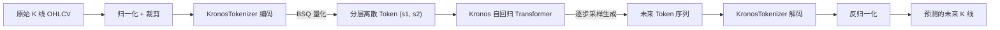

# 03. 模型架构

本篇深入讲解 Kronos 的两阶段框架与各核心模块。源码位于 [model/kronos.py](../model/kronos.py) 与 [model/module.py](../model/module.py)。

## 3.1 整体框架：两阶段设计

- **阶段一（Tokenizer）**：把连续多维 K 线压缩为离散 token，并能从 token 重建回 K 线。
- **阶段二（Transformer）**：在 token 空间上做自回归语言建模，预测未来 token，再交由 Tokenizer 解码。

## 3.2 KronosTokenizer：量化器

源码：[model/kronos.py](../model/kronos.py) 中的 `KronosTokenizer` 类。

### 工作流程

1. **Embed**：`nn.Linear(d_in, d_model)` 把原始特征投影到模型维度。
2. **Encoder**：若干 `TransformerBlock` 编码上下文信息。
3. **量化前投影**：`quant_embed` 把隐藏状态投影到 `codebook_dim = s1_bits + s2_bits` 维。
4. **BSQuantizer（核心）**：执行二值球面量化，得到量化向量 `quantized`、量化损失 `bsq_loss` 与索引 `z_indices`。
5. **分层解码**：
   - `z_pre`：仅使用前 `s1_bits` 位（粗粒度）重建。
   - `z`：使用完整 codebook 重建。
   - 两路都经过 Decoder（`TransformerBlock`）与 `head` 投影回 `d_in`。

### 关键方法

| 方法 | 作用 |
| --- | --- |
| `forward(x)` | 训练用：返回 `(z_pre, z)` 重建结果、量化损失、量化向量与索引。 |
| `encode(x, half)` | 把输入编码为离散 token 索引（推理用）。`half=True` 时返回 `[s1_indices, s2_indices]`。 |
| `decode(x, half)` | 把 token 索引解码回 K 线特征空间。 |
| `indices_to_bits(x, half)` | 将整数索引展开为 ±1 的比特向量并做球面缩放。 |

### BSQ（二值球面量化）原理

源码：[model/module.py](../model/module.py) 中的 `BinarySphericalQuantizer` 与 `BSQuantizer`。

- 对归一化后的向量 `z`，按每一维的符号量化为 `+1 / -1`（`zhat = sign(z)`），并使用**直通估计（straight-through estimator）** `z + (zhat - z).detach()` 让梯度可回传。
- 量化后做球面缩放 `1/sqrt(embed_dim)`，使所有码字落在单位球面上。
- 通过 `basis = 2^k` 把 ±1 比特向量与整数索引相互转换。
- 损失由两部分构成：
  - **commit loss**：约束编码器输出靠近量化结果。
  - **entropy penalty（熵惩罚）**：鼓励码本被充分、均匀地使用（`soft_entropy_loss`），由 `gamma0`、`gamma`、`zeta`、`beta` 等权重控制。

> **分层 Token 的含义**：`s1_bits` 为「粗粒度（pre）」token 的位数，`s2_bits` 为「细粒度（post）」token 的位数。先预测 s1，再在 s1 条件下预测 s2，从而把一个巨大的联合词表分解为两个较小的词表，降低建模难度。

## 3.3 Kronos：自回归 Transformer

源码：[model/kronos.py](../model/kronos.py) 中的 `Kronos` 类。

### 结构组成

| 组件 | 类型 | 作用 |
| --- | --- | --- |
| `embedding` | `HierarchicalEmbedding` | 将 (s1_ids, s2_ids) 融合为统一的 token 嵌入。 |
| `time_emb` | `TemporalEmbedding` | 注入分钟/小时/星期/日/月等时间特征。 |
| `transformer` | `nn.ModuleList[TransformerBlock]` | 主干，带 RoPE 的因果自注意力堆叠。 |
| `norm` | `RMSNorm` | 输出层归一化。 |
| `dep_layer` | `DependencyAwareLayer` | 让 s2 的预测「感知」已选定的 s1（依赖建模）。 |
| `head` | `DualHead` | 双头输出：分别预测 s1 与 s2 的 logits。 |

### 前向逻辑（forward）

1. 通过 `HierarchicalEmbedding` 把 s1、s2 嵌入融合；叠加 `TemporalEmbedding` 时间嵌入。
2. 经过若干 `TransformerBlock`（因果注意力）得到上下文表示 `x`。
3. `head(x)` 得到 **s1_logits**。
4. 依据是否 teacher forcing 决定 s1 的嵌入来源（真实目标 or 采样结果）。
5. `dep_layer` 用 s1 嵌入作为 query 对上下文做交叉注意力，得到 `x2`。
6. `head.cond_forward(x2)` 得到 **s2_logits**（在 s1 条件下）。

### 推理专用方法

- `decode_s1(...)`：只预测 s1，并返回上下文表示 `context`，供后续 s2 解码复用，避免重复计算。
- `decode_s2(context, s1_ids, ...)`：基于 `context` 与已采样的 s1，预测 s2。

## 3.4 自回归推理：auto_regressive_inference

源码：[model/kronos.py](../model/kronos.py) 中的 `auto_regressive_inference` 函数，是预测的核心循环。

关键步骤：

1. 对输入做 `clip` 裁剪，并按 `sample_count` 复制多份以并行生成多条路径。
2. 用 `tokenizer.encode(x, half=True)` 得到历史 token。
3. 维护 `pre_buffer` / `post_buffer` 两个滑动缓冲区（长度 `max_context`）。
4. 循环 `pred_len` 步，每一步：
   - 取当前上下文窗口，调用 `decode_s1` → 采样 s1。
   - 调用 `decode_s2` → 采样 s2。
   - 把新 token 写入缓冲区（未满则追加，已满则 `torch.roll` 滚动）。
5. 拼接历史与生成的 token，调用 `tokenizer.decode` 解码回特征。
6. 对 `sample_count` 条路径取均值，返回 numpy 预测结果。

### 采样工具函数

- `top_k_top_p_filtering`：对 logits 做 Top-k / Top-p（核采样）过滤。
- `sample_from_logits`：按温度缩放后采样（或取 argmax）。
- `calc_time_stamps`：从时间戳提取 `minute/hour/weekday/day/month` 时间特征。

## 3.5 module.py 中的基础模块一览

| 模块 | 说明 |
| --- | --- |
| `RMSNorm` | 均方根归一化，替代 LayerNorm，计算更轻量。 |
| `FeedForward` | SwiGLU 风格前馈网络（`w2(silu(w1(x)) * w3(x))`）。 |
| `RotaryPositionalEmbedding` | 旋转位置编码（RoPE），带 cos/sin 缓存。 |
| `MultiHeadAttentionWithRoPE` | 带 RoPE 的多头**因果**自注意力。 |
| `MultiHeadCrossAttentionWithRoPE` | 带 RoPE 的多头交叉注意力（用于依赖层）。 |
| `HierarchicalEmbedding` | 将 s1、s2 两路嵌入拼接后投影融合；可拆分复合 token。 |
| `DependencyAwareLayer` | 通过交叉注意力让一个子 token 感知另一个子 token。 |
| `TransformerBlock` | Pre-Norm 残差结构：自注意力 + 前馈。 |
| `DualHead` | 双输出头，含 `compute_loss` 计算 s1/s2 交叉熵。 |
| `FixedEmbedding` | 正弦固定（不可学习）嵌入。 |
| `TemporalEmbedding` | 5 类时间特征嵌入求和，可选可学习/固定。 |
| `BinarySphericalQuantizer` / `BSQuantizer` | 二值球面量化核心实现。 |
| `DifferentiableEntropyFunction` | 可微的码本熵计算（自定义 autograd Function）。 |

## 3.6 数据流维度速览

设 batch 为 B、序列长度为 T：

- 输入 K 线：`x: [B, T, d_in]`（d_in 通常为 6：OHLCV + amount）。
- Tokenizer 编码后：`s1_ids: [B, T]`、`s2_ids: [B, T]`。
- Transformer 隐藏态：`[B, T, d_model]`。
- s1_logits：`[B, T, 2^s1_bits]`；s2_logits：`[B, T, 2^s2_bits]`。
- 解码重建：`[B, T, d_in]`。

下一篇：[04_核心API参考.md](./04_核心API参考.md)
