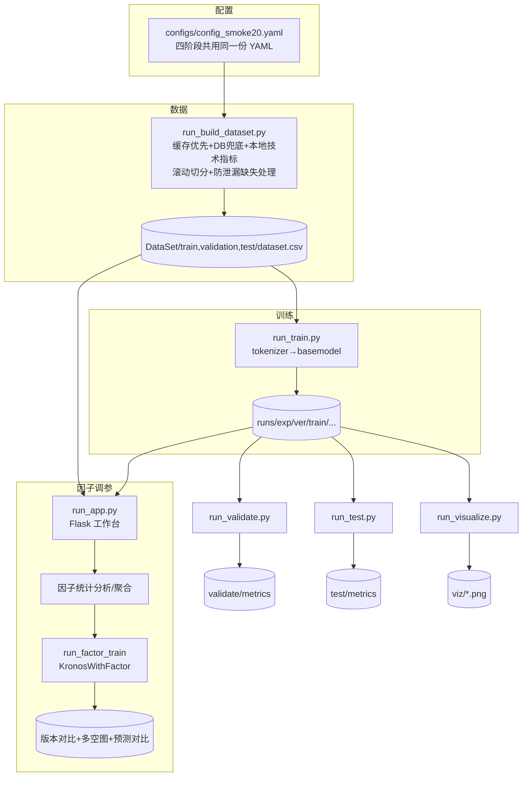

# Kronos × Quantia 全流程操作指南（数据集 → 训练 → 验证 → 测试 → 因子调参）

> 本文基于 `finetune_csv/` 当前代码逐行核对编写，覆盖从「构建 A 股数据集」到「因子调参工作台」的完整链路。
> 所有命令均在仓库根目录 `C:\xapproject\Quantia\Kronos`、项目 `.venv`（Python 3.10+，本机 3.12）下验证通过。
>
> 与 [05_微调指南.md](./05_微调指南.md)（通用 CSV / Qlib 两套路线）互补：本文专注 **Quantia 集成的统一流水线**
> （`run_build_dataset.py → run_train.py → run_validate.py → run_test.py → run_app.py`），强调**真实训练 / 调参场景**的可执行步骤。

---

## 0. 总览：一图看懂流水线



**核心理念**：四个阶段（构建 / 训练 / 验证 / 测试）**共用同一份 YAML**（[finetune_csv/configs/config_smoke20.yaml](../finetune_csv/configs/config_smoke20.yaml)），
版本号在一次进程内只解析一次，确保各阶段写入同一个 `runs/<exp>/<version>/` 目录，避免参数散落、难以复现。

---

## 1. 环境准备

```powershell
cd C:\xapproject\Quantia\Kronos

# 激活项目虚拟环境（务必用 .venv，Flask / matplotlib 等仅装在此）
.\.venv\Scripts\Activate.ps1

# 首次或依赖缺失时
pip install -r requirements.txt
```

要点：

- **CPU / GPU 自动选择**：`device.use_cuda: true` 且有可用 CUDA 时用 GPU，否则回退 CPU。本机为 CPU。
- **Windows 上 `num_workers: 0`**：避免多进程 DataLoader 在 Windows 的兼容问题（已在默认配置中设好）。
- **包内模块运行**：以 `-m finetune_csv.xxx` 方式运行 `pipeline/` 或 `app/` 子模块时，需先设
  `$env:PYTHONPATH="finetune_csv"`（因为包内 `from config_loader import ...` 依赖该路径）。
  直接运行 `python finetune_csv/run_xxx.py` 则无需设置（脚本头部已自行 `sys.path` 注入）。

---

## 2. 第一步：构建训练 / 验证 / 测试数据集

入口：[finetune_csv/run_build_dataset.py](../finetune_csv/run_build_dataset.py)

### 2.1 数据来源与字段

| 来源 | 内容 | 说明 |
| --- | --- | --- |
| Quantia 缓存 `cache/hist` | 日线 OHLCV（前复权） | **优先**读取，`{code}qfq.gzip.pickle` |
| DB `cn_stock_spot` | 日线快照 | 缓存缺失时**兜底** |
| 本地现算（默认） | 32 个技术指标 `tech_*` | `tech_source: local`，用 OHLCV 现算（历史完整） |
| DB `cn_stock_financial` | 22 个基本面 `fin_*` | `use_db_features: true` 时按报告期 `merge_asof` 回填 |

> 为什么技术指标默认本地现算？远程库 `cn_stock_indicators` 对 2020~2026 训练区间约 **97% 为空**，
> 故改用 [pipeline/indicators.py](../finetune_csv/pipeline/indicators.py) 的 `compute_tech_indicators`（纯 pandas，无需 TA-Lib），
> 口径自控、可复现，且**只用当前及过去数据，不引入未来信息**。

### 2.2 输出产物

```
DataSet/
  train/dataset.csv
  validation/dataset.csv
  test/dataset.csv
runs/<exp>/<version>/build/
  run.log               # 过程日志
  split_plan.json       # 滚动切分边界
  missing_report.json   # 各因子缺失率 + 追加的 *_isna 掩码列
  build_report.json     # 股票池、行数、因子列清单
```

`dataset.csv` 列结构：

```
date, symbol, open, high, low, close, volume, amount, amplitude, quote_change, ups_downs, turnover,
ret_1d, ret_5d, ma_5, ma_10, ma_20, ...,                 # 本地派生特征
tech_macd, tech_rsi, ...(32 个),                          # 技术因子
fin_eps, fin_roe, ...(22 个),                             # 基本面因子
<col>_isna,                                               # 缺失掩码（缺失率>5%的列）
future_close, future_date, label_fwd_ret_5d,             # 标签（前看 5 日收益）
split, kline_source
```

### 2.3 滚动日期切分（防泄漏）

切分以「锚点（默认今天-1）」向过去回推：`test_days` → `val_days` → `train_days`（0=剩余全部）。
**边界清洗（purge）**：只有当样本的标签窗口 `future_date` 也落在本区间内时才保留，杜绝标签跨越切分边界造成泄漏。

```yaml
splits:
  anchor: ""           # 留空 = 今天-1
  test_days: 40
  val_days: 40
  train_days: 0        # 0 = 锚点之前剩余全部
  label_horizon: 5     # 前看 5 日收益
```

### 2.4 缺失值处理（leak-safe）——重点

逻辑见 [pipeline/factors.py](../finetune_csv/pipeline/factors.py) `handle_factor_nulls`：

1. **按 `symbol` 分组前向填充（ffill）**：只用「过去」信息，且**绝不跨标的串值**。
2. **开头兜底**：序列开头 ffill 无值时，用「该列**训练区间**中位数」兜底（仍是历史统计，无未来泄漏），再不行填 0。
   - `fin_*` / `tech_*` → `ffill` 策略（中位数兜底）。
   - `news_/event_/sent_` → `zero` 策略（缺失即「无事件」）。
3. **保留缺失信息**：缺失率 > `mask_threshold`(默认 5%) 的列，额外生成 `<col>_isna` 掩码列（1=原缺失），
   让模型有机会学习「缺失本身」的含义。
4. **禁止全局 `bfill`**：会把未来值带到过去，构成泄漏。

```yaml
factors:
  add_mask: true
  mask_threshold: 0.05
  strategy: {}          # 显式覆盖，如 {fin_roe: ffill, news_count: zero}
```

> ⚠️ 同样的「分组 ffill + 中位数兜底、禁止 bfill」原则也已下沉到训练期的
> [pipeline/factor_dataset.py](../finetune_csv/pipeline/factor_dataset.py) `build_factor_matrix`，
> 保证即使输入未完全填充也不会跨标的串味或引入未来值。

### 2.5 操作步骤

**A) 冒烟自测（合成数据，不依赖缓存 / DB）——先验证链路**

```powershell
.\.venv\Scripts\python.exe finetune_csv\run_build_dataset.py --smoke
```

**B) 小范围真实构建（20 只股票，默认配置）**

```powershell
.\.venv\Scripts\python.exe finetune_csv\run_build_dataset.py --config finetune_csv\configs\config_smoke20.yaml
```

**C) 全市场构建（独立脚本，DB 技术指标版）**

```powershell
.\.venv\Scripts\python.exe finetune_csv\build_full_market_dataset.py `
  --quantia-root C:/xapproject/Quantia/Quantia `
  --out-root C:/xapproject/Quantia/Kronos/DataSet `
  --start-date 2017-01-01 --train-end 2022-12-31 --validation-end 2024-12-31 `
  --label-horizon 5 --max-symbols 0
```

> 两个构建脚本的差异：`run_build_dataset.py`（推荐）走统一 YAML + 本地技术指标 + `*_isna` 掩码 + 滚动切分；
> `build_full_market_dataset.py` 是早期全市场脚本，技术指标取自 DB，按固定日期切分。生产环境用前者。

### 2.6 构建后自检清单

```powershell
# 看行数 / 切分 / 因子列
Get-Content runs\kronos_smoke20\*\build\build_report.json | Select-String "rows|symbols|factor_count"
# 看缺失率与掩码列
Get-Content runs\kronos_smoke20\*\build\missing_report.json
```

人工核对：① 三份 CSV 均非空；② `label_fwd_ret_5d` 无 NaN；③ test 的最早日期 > validation 的最晚日期（无重叠）。

---

## 3. 第二步：训练（tokenizer → basemodel）

入口：[finetune_csv/run_train.py](../finetune_csv/run_train.py)

```powershell
# 冒烟（合成数据，不下载权重）
.\.venv\Scripts\python.exe finetune_csv\run_train.py --smoke

# 真实训练（先 tokenizer 再 predictor）
.\.venv\Scripts\python.exe finetune_csv\run_train.py --config finetune_csv\configs\config_smoke20.yaml

# 仅训练某一阶段
.\.venv\Scripts\python.exe finetune_csv\run_train.py --config ... --skip-tokenizer    # 只训 basemodel
.\.venv\Scripts\python.exe finetune_csv\run_train.py --config ... --skip-basemodel    # 只训 tokenizer
```

关键参数（`training` 段）：

| 参数 | 含义 | 建议 |
| --- | --- | --- |
| `tokenizer_epochs` / `basemodel_epochs` | 各阶段轮数 | 小验证 10；全市场按数据量增大 |
| `batch_size` | 批大小 | CPU 上调小（4~16）；GPU 视显存 |
| `patience` | 早停耐心 | 连续 N 轮验证无提升即停（默认 8） |
| `predictor_learning_rate` | 预测器学习率 | `1e-5`（微调宜小） |
| `num_workers` | DataLoader 进程 | **Windows 必须 0** |

产物：`runs/<exp>/<version>/train/{tokenizer,basemodel}/{run.log,metrics.csv,run_meta.json,summary.json,best_model/}`。

> **硬约束**：`lookback_window + predict_window ≤ max_context(512)`（Kronos-base/small）。配置已默认 `90 + 10`。

---

## 4. 第三步 / 第四步：验证与测试

入口：[run_validate.py](../finetune_csv/run_validate.py) / [run_test.py](../finetune_csv/run_test.py)（均为 `pipeline/eval_runner.run_eval_stage` 的薄封装）

```powershell
# 验证集评估（默认取该 exp 下最近一次训练版本）
.\.venv\Scripts\python.exe finetune_csv\run_validate.py --config finetune_csv\configs\config_smoke20.yaml

# 测试集评估；--version 显式对齐到某次训练
.\.venv\Scripts\python.exe finetune_csv\run_test.py --config finetune_csv\configs\config_smoke20.yaml --version 20260624_xxxx
```

评估指标（[pipeline/evaluate.py](../finetune_csv/pipeline/evaluate.py)）：

- `tokenizer_recon_mse`：tokenizer 重建误差。
- `predictor_loss`：与训练期验证损失**完全一致**的口径（交叉熵），可交叉印证。

产物落在 `runs/<exp>/<version>/{validate,test}/`。

---

## 5. 可视化（K 线预测对比 + 因子权重）

入口：[run_visualize.py](../finetune_csv/run_visualize.py)

```powershell
.\.venv\Scripts\python.exe finetune_csv\run_visualize.py --smoke                                  # 合成自测
.\.venv\Scripts\python.exe finetune_csv\run_visualize.py --config ... --version 20260624_xxxx     # 真实
```

产物：`runs/<exp>/<version>/viz/{kline_comparison.png, factor_weights.png/.json}`。CJK 字体自动适配（[viz/_fonts.py](../finetune_csv/viz/_fonts.py)）。

---

## 6. 因子调参工作台（重点）

入口：[finetune_csv/run_app.py](../finetune_csv/run_app.py) — Flask + 原生 HTML/JS，零额外前端依赖。

```powershell
# 必须用 .venv 的 python（Flask 仅装在此）
.\.venv\Scripts\python.exe finetune_csv\run_app.py --config finetune_csv\configs\config_smoke20.yaml --port 5057
# 浏览器打开 http://127.0.0.1:5057
```

### 6.1 工作台能力

| 区域 | 功能 |
| --- | --- |
| 顶部 KPI | 综合方向、综合评分、置信度、信号分歧、预期收益(5日)、日波动百分比 |
| 左侧因子面板 | 54 因子**按大类分组**，每类可选「独立参与 / 同类取均值」聚合；含中文名、说明、多空方向、强度评分、冗余 ⚠ 标记、权重滑杆 |
| 右侧多空图 | 按大类的发散条形图（绿多 / 红空），条长=强度 |
| 提交重训 | 选定因子 / 聚合 / 权重 + 轮数 + 底座版本 → 后台串行训练 |
| 版本对比 | 因子重要性（factor_emb 各列 L2）、指标、`factor_weights.png`、`kline_comparison.png` |

### 6.2 因子统计分析（IC 画像）

逻辑见 [app/factor_analysis.py](../finetune_csv/app/factor_analysis.py)，**无需训练模型**，直接从 `DataSet/train` 统计：

- **单因子 IC（rank IC / Spearman 秩相关）**：因子值与未来收益的相关性。
  - `direction`（多空）= IC 符号（+1 偏多 / −1 偏空 / 0 中性）。
  - `score`（强度 0~100）= |IC| 相对归一。
  - `confidence`（置信度 0~1）= 由 t 统计量映射（样本越多、相关越强越可信）。
  - `contribution`（贡献占比）= 所选因子中 |IC|×权重 的归一份额。
- **同类冗余**：同一大类内两两秩相关 |corr| ≥ 0.85 视为冗余（前端打 ⚠）。
- **综合画像**：方向对齐的类别 z 合成信号 → 加权净票决定综合方向 / 评分；`divergence=1−|净票|`（0=高度一致，1=完全分歧）；
  线性预期收益 `≈ mean(IC×z×权重)×目标 std`。

> 注：`scipy` **未安装**，Spearman 一律用 `f.rank().corr(t.rank())` 实现，切勿改回 `df.corr(method='spearman')`。

### 6.3 同类型因子是否该多选？——分析与建议

技术指标里**同族多变体**很常见（如 `rsi_6/rsi_12/rsi/rsi_24`、`wr_6/wr_10/wr_14`、`kdjk/kdjd/kdjj`、`macd/macds/macdh`）。
它们高度相关，**全选会造成冗余**：放大同一信号、稀释其它类别、并可能过拟合。处理建议（工作台已内建）：

1. **看冗余标记**：某大类出现 ⚠ 冗余对，说明成员高度同向。
2. **二选一 或 同类取均值**：在该类下拉切换为「**同类取均值**」——把成员**方向对齐**（按 IC 符号）后做 z 均值，
   合成**单一影响因子**参与训练（通道维度从 N 降为 1），既保留信号又消除冗余。
3. **跨类优先保留低相关因子**：趋势 / 动量 / 波动 / 量能 / 基本面之间相关性低，更值得各保留一路。

实现见 [pipeline/factor_dataset.py](../finetune_csv/pipeline/factor_dataset.py) `normalize_specs` / `build_factor_matrix`：
`mode="mean"` 时各成员**全局 z-score × 方向**后取均值得到单通道；训练期再对该通道做**逐窗 lookback z-score**（防泄漏）。

### 6.4 预测对比（Kronos 原始 vs 因子调整 vs 实际）

每次重训完成后，[pipeline/factor_viz.py](../finetune_csv/pipeline/factor_viz.py) `generate_factor_comparison` 会在测试集某只股票上
同时跑**基线 Kronos**（仅 OHLCV）与**因子增强 Kronos**，叠加真实未来 K 线，输出 `viz/kline_comparison.png`
（标题含 原始 / 因子调整 / 实际 三者收益），该步用 `try/except` 保护，失败不影响训练任务本身。

---

## 7. 真实训练 / 调参场景：端到端操作清单

### 场景 A：从零做一次全市场微调

```powershell
.\.venv\Scripts\Activate.ps1

# 1) 构建全市场数据集（按需调 max-symbols / 日期 / 切分边界）
.\.venv\Scripts\python.exe finetune_csv\run_build_dataset.py --config finetune_csv\configs\config_smoke20.yaml
#    自检：build_report.json / missing_report.json

# 2) 训练 tokenizer + basemodel
.\.venv\Scripts\python.exe finetune_csv\run_train.py --config finetune_csv\configs\config_smoke20.yaml

# 3) 验证 + 测试（记下 version）
.\.venv\Scripts\python.exe finetune_csv\run_validate.py --config finetune_csv\configs\config_smoke20.yaml
.\.venv\Scripts\python.exe finetune_csv\run_test.py     --config finetune_csv\configs\config_smoke20.yaml

# 4) 可视化抽查
.\.venv\Scripts\python.exe finetune_csv\run_visualize.py --config finetune_csv\configs\config_smoke20.yaml
```

> 提示：把 `config_smoke20.yaml` 复制一份改名（如 `config_full.yaml`），调大 `universe.max_symbols`、
> `training.*_epochs`、`batch_size`，并把 `model_paths.exp_name` 改成新实验名以独立留存。

### 场景 B：在已训练底座上做因子调参迭代

```powershell
# 启动工作台
.\.venv\Scripts\python.exe finetune_csv\run_app.py --config finetune_csv\configs\config_smoke20.yaml --port 5057
```

页面操作建议流程：

1. **看 KPI 与多空图**：先了解综合方向 / 分歧 / 各类强度。
2. **剔除冗余**：对带 ⚠ 的技术族切换「同类取均值」或只留代表因子。
3. **设权重**：高 IC、跨类、低冗余的因子给更高权重；噪声因子权重设 0（等价关闭）。
4. **选底座版本 + 轮数 → 提交重训**：后台串行训练，进度实时轮询。
5. **版本对比**：用 `factor_importance`（训练后真实贡献）与 IC 画像（统计先验）**交叉验证**；
   看 `kline_comparison.png` 判断因子是否真的改善了预测形态与收益。
6. **迭代**：根据对比结果增删因子 / 调权重，再训一版。

---

## 8. 冒烟自测总览（改动后务必逐项跑）

```powershell
$env:PYTHONPATH="finetune_csv"

.\.venv\Scripts\python.exe finetune_csv\run_build_dataset.py --smoke               # 数据构建链路
.\.venv\Scripts\python.exe -m finetune_csv.app.factor_meta --smoke                 # 因子知识库（54 因子/12 类）
.\.venv\Scripts\python.exe -m finetune_csv.app.factor_analysis --smoke             # IC 统计画像
.\.venv\Scripts\python.exe finetune_csv\pipeline\factor_dataset.py --smoke         # 因子数据集 + 聚合 + 缺失防跨标的
.\.venv\Scripts\python.exe -m finetune_csv.pipeline.factor_train_runner --smoke    # 因子模型训练
.\.venv\Scripts\python.exe finetune_csv\run_train.py --smoke                       # tokenizer/basemodel 训练
.\.venv\Scripts\python.exe finetune_csv\run_visualize.py --smoke                   # 可视化
.\.venv\Scripts\python.exe finetune_csv\app\_smoke_e2e.py                          # 工作台端到端（含 /api/analysis + 预测对比图）
```

全部应打印 `[smoke] ... 通过`，且 `_smoke_e2e.py` 会生成 `factor_weights.png` 与 `kline_comparison.png`。

---

## 9. 常见问题（FAQ）

| 现象 | 原因 / 解决 |
| --- | --- |
| `ModuleNotFoundError: config_loader` | 以 `-m finetune_csv.xxx` 运行时未设 `$env:PYTHONPATH="finetune_csv"` |
| `Object of type int64 is not JSON serializable` | 已由 `app/server.py` 的 `_NumpyJSONProvider` 处理；自定义接口注意转 `.item()` |
| `df.corr(method='spearman')` 报错 | 本机无 `scipy`，改用 `f.rank().corr(t.rank())` |
| 工作台连接被拒 | 必须用 `.venv` 的 python 启动（Flask 仅装在 venv）；确认端口未被占用 |
| 全市场 CPU 训练很慢 | 预期内；先用 `config_smoke20` 跑通，再上 GPU / 调大数据量 |
| 因子列在 CSV 中缺失 | 构建期 `handle_factor_nulls` 已分组 ffill + 中位数兜底；训练期 `build_factor_matrix` 再次防跨标的兜底 |

---

## 10. 关键源码索引

| 模块 | 职责 |
| --- | --- |
| [run_build_dataset.py](../finetune_csv/run_build_dataset.py) | 统一数据集构建编排 |
| [pipeline/indicators.py](../finetune_csv/pipeline/indicators.py) | 本地技术指标现算（32 个 `tech_*`） |
| [pipeline/factors.py](../finetune_csv/pipeline/factors.py) | 防泄漏缺失处理 + `*_isna` 掩码 |
| [pipeline/splits.py](../finetune_csv/pipeline/splits.py) | 滚动日期切分 + 边界清洗 |
| [pipeline/factor_dataset.py](../finetune_csv/pipeline/factor_dataset.py) | 因子条件数据集 + 同类聚合 + 防跨标的填充 |
| [pipeline/factor_train_runner.py](../finetune_csv/pipeline/factor_train_runner.py) | `KronosWithFactor` 训练编排 |
| [pipeline/factor_viz.py](../finetune_csv/pipeline/factor_viz.py) | Kronos 原始 vs 因子调整预测对比图 |
| [app/factor_meta.py](../finetune_csv/app/factor_meta.py) | 54 因子中文知识库（12 大类） |
| [app/factor_analysis.py](../finetune_csv/app/factor_analysis.py) | IC 统计画像（方向/评分/置信度/冗余/综合） |
| [app/server.py](../finetune_csv/app/server.py) | Flask 后端 REST 接口 |
| [app/jobs.py](../finetune_csv/app/jobs.py) | 后台串行训练任务管理 |
</content>
</invoke>
