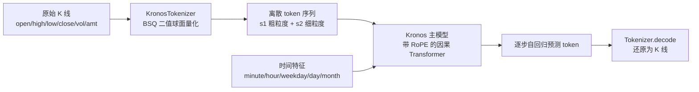

# Kronos A 股市场微调操作指南（含 LoRA 与多因子增强）

> 本文基于当前仓库代码逐行核对编写，并在 `Python 3.12.10 + 项目 .venv` 环境下完成可运行性验证。
> 适用对象：希望用 A 股数据微调 Kronos，并探索加入消息面 / 基本面因子的用户。

---

## 0. 验证状态摘要（本机已实测）

| 验证项 | 结果 |
| --- | --- |
| Python | `3.12.10`（项目 `.venv`） |
| `torch / pandas / numpy / yaml / einops / huggingface_hub / modelscope / matplotlib / tqdm` | ✅ 已安装 |
| `qlib` | ❌ 未安装（→ 建议走 CSV 路线，或单独安装 qlib） |
| `peft` | ❌ 未安装（→ 如需 LoRA 需 `pip install peft` 并按本文第 7 章接入） |
| `from model import Kronos, KronosTokenizer, KronosPredictor` | ✅ 导入成功 |
| 示例数据 `finetune_csv/data/HK_ali_09988_kline_5min_all.csv` | ✅ 93912 行，列：`timestamps, open, close, high, low, volume, amount` |

结论：本机当前**最稳的路线是 `finetune_csv/`（自定义 CSV 微调）**；若要做全市场 + 回测，再补装 `qlib` 走 `finetune/` 路线。

---

## 1. Kronos 模型分析

Kronos 是面向金融 K 线的「分词器 + 自回归 Transformer」基础模型，整体分两段：



### 1.1 关键组件（源码位置）

- **KronosTokenizer**（[model/kronos.py](../../model/kronos.py)）
  - `self.embed = nn.Linear(d_in, d_model)`：输入投影，**`d_in` 决定了输入特征维度**。预训练权重 `d_in = 6`（`open, high, low, close, vol, amt`）。
  - `BSQuantizer`（二值球面量化）：把连续特征压成离散 token，分 `s1_bits`（粗）+ `s2_bits`（细）两级。
  - `self.head = nn.Linear(d_model, d_in)`：解码重建回 6 维特征。
- **Kronos 主模型**（[model/kronos.py](../../model/kronos.py)）
  - `HierarchicalEmbedding` + `TemporalEmbedding`：token 嵌入与**时间特征**嵌入分两路注入。
  - 堆叠 `TransformerBlock`（RoPE 旋转位置编码 + 因果自注意力）。
  - `DualHead`：分别输出 s1 / s2 的 logits，`compute_loss` 计算交叉熵。
- **KronosPredictor**（[model/kronos.py](../../model/kronos.py)）：高层封装，负责「校验 → 补全 volume/amount → 归一化（z-score + 裁剪 ±clip）→ 自回归推理 → 反归一化 → 组装 DataFrame」。

### 1.2 重要约束（直接影响微调配置）

| 参数 | 含义 | 取值 / 约束 |
| --- | --- | --- |
| `d_in` | 输入特征维度 | 预训练为 **6**；**改变它会使预训练 `embed`/`head` 权重失配**（详见第 8 章）。 |
| `max_context` | 上下文上限 | Kronos-base/small = **512**，Kronos-mini = 2048。 |
| `lookback_window` | 历史输入步数 | 有效范围 1 ~ `max_context`；超出会被滑动窗口截断到最近 `max_context`。 |
| `predict_window` | 预测步数 | ≥1，无硬上限，但越长误差累积越大，且需 `lookback+predict ≤ 数据长度`。 |
| 时间特征 | 条件输入 | `minute/hour/weekday/day/month`，由时间戳自动派生，**不占用 `d_in`**。 |

---

## 2. 两套微调路线对比（A 股选型）

| 维度 | `finetune/`（Qlib 路线） | `finetune_csv/`（CSV 路线，✅ 本机推荐） |
| --- | --- | --- |
| 数据源 | Qlib 数据库（`csi300` 等全市场） | 任意 CSV（单标的 / 自有数据） |
| 依赖 | 需 `qlib`（本机未装） | 仅常规依赖（本机已装） |
| 配置 | [finetune/config.py](../../finetune/config.py) | YAML，见 [finetune_csv/configs/config_ali09988_candle-5min.yaml](../../finetune_csv/configs/config_ali09988_candle-5min.yaml) |
| 训练入口 | `train_tokenizer.py` → `train_predictor.py`（DDP） | `train_sequential.py`（一键顺序训练） |
| 回测 | 内置 `qlib_test.py` | 需自行编写（参考 `finetune_csv/examples/`） |
| 适合 | 全市场选股 + 标准回测 | 快速微调指定股票 / 自定义周期 |

> 下文第 3~6 章以 **CSV 路线**给出完整可执行步骤；第 9 章补充 Qlib 路线要点。

---

## 3. 环境准备

```powershell
# 在仓库根目录，使用项目 venv
cd C:\xapproject\Quantia\Kronos
.\.venv\Scripts\Activate.ps1

# 核心依赖（本机已确认安装）
pip install -r requirements.txt

# 若走 Qlib 全市场路线，另需：
# pip install pyqlib
# 若要做 LoRA 参数高效微调，另需：
# pip install peft
```

预训练权重（二选一）：

```powershell
# 方式 A：HuggingFace（需可访问）
#   Kronos-Tokenizer-base / Kronos-base

# 方式 B：ModelScope（国内推荐，代码已内置 from_modelscope）
#   AI-ModelScope/Kronos-Tokenizer-base
#   AI-ModelScope/Kronos-base
```

建议把权重下载到本地目录，例如：

```
C:\xapproject\Quantia\Kronos\pretrained\Kronos-Tokenizer-base
C:\xapproject\Quantia\Kronos\pretrained\Kronos-base
```

---

## 4. 准备 A 股数据（CSV）

### 4.1 目标格式

CSV 必须包含以下列（`volume/amount` 没有时可填 0）：

```
timestamps,open,high,low,close,volume,amount
```

> 注意：示例文件列顺序是 `open,close,high,low,...`，pandas 按列名读取，顺序不强制，但**列名必须齐全**。

### 4.2 用 akshare 获取 A 股日线（示例脚本）

仓库 `examples/` 已有 akshare 取数样例（`get_akshare_date_2024-2025_x.py` 等）。下面给出最小可用转换片段：

```python
import akshare as ak
import pandas as pd

# 以平安银行 000001 为例，前复权日线
df = ak.stock_zh_a_hist(symbol="000001", period="daily",
                        start_date="20150101", end_date="20251231", adjust="qfq")

# akshare 返回中文列名，统一映射为 Kronos 所需英文列
df = df.rename(columns={
    "日期": "timestamps", "开盘": "open", "最高": "high",
    "最低": "low", "收盘": "close", "成交量": "volume", "成交额": "amount",
})
df = df[["timestamps", "open", "high", "low", "close", "volume", "amount"]]
df["timestamps"] = pd.to_datetime(df["timestamps"])
df = df.sort_values("timestamps").reset_index(drop=True)
df.to_csv("finetune_csv/data/A_000001_daily.csv", index=False)
print(len(df), "rows saved")
```

> 数据量建议：单标的至少几千根 K 线；要微调出稳定效果，建议**多标的拼接**（每个标的内部时间连续，标的之间不要跨接），或使用分钟级数据扩充样本量（示例 09988 为 5 分钟、9.3 万行）。

### 4.3 数据质量检查清单

- [ ] 无缺失值（价格 / 量列不能有 NaN，`KronosPredictor.predict` 会直接报错）。
- [ ] 时间升序、无重复时间戳。
- [ ] 价格为正、`high ≥ max(open,close) ≥ min(open,close) ≥ low`。
- [ ] 复权方式一致（建议统一前复权 `qfq`）。

---

## 5. 编写配置文件

复制模板并改成你的 A 股配置：

```powershell
Copy-Item finetune_csv\configs\config_ali09988_candle-5min.yaml `
          finetune_csv\configs\config_a_000001_daily.yaml
```

修改关键字段（`finetune_csv/configs/config_a_000001_daily.yaml`）：

```yaml
data:
  data_path: "C:/xapproject/Quantia/Kronos/finetune_csv/data/A_000001_daily.csv"
  lookback_window: 90       # 日线常用 60~120；分钟线可用 256~512
  predict_window: 10        # 想预测的未来步数
  max_context: 512
  clip: 5.0
  train_ratio: 0.9
  val_ratio: 0.1
  test_ratio: 0.0

training:
  tokenizer_epochs: 30
  basemodel_epochs: 20
  batch_size: 32            # 显存不足就调小（如 8/16）
  log_interval: 50
  num_workers: 4
  seed: 42
  tokenizer_learning_rate: 0.0002
  predictor_learning_rate: 0.000001
  adam_beta1: 0.9
  adam_beta2: 0.95
  adam_weight_decay: 0.1
  accumulation_steps: 1

model_paths:
  pretrained_tokenizer: "C:/xapproject/Quantia/Kronos/pretrained/Kronos-Tokenizer-base"
  pretrained_predictor: "C:/xapproject/Quantia/Kronos/pretrained/Kronos-base"
  exp_name: "A_000001_daily"
  base_path: "C:/xapproject/Quantia/Kronos/finetune_csv/finetuned/"
  base_save_path: ""        # 留空自动生成 {base_path}/{exp_name}
  finetuned_tokenizer: ""   # 留空自动生成
  tokenizer_save_name: "tokenizer"
  basemodel_save_name: "basemodel"

experiment:
  name: "kronos_a_finetune"
  description: "A-share 000001 daily finetune"
  use_comet: false
  train_tokenizer: true
  train_basemodel: true
  skip_existing: false

device:
  use_cuda: true            # 无 GPU 时自动回退 CPU（会很慢）
  device_id: 0
```

> 路径解析逻辑见 [finetune_csv/config_loader.py](../../finetune_csv/config_loader.py)：`base_save_path` / `finetuned_tokenizer` 留空字符串时会按 `exp_name` 自动拼接。

---

## 6. 训练步骤（CSV 路线）

训练遵循「**先 Tokenizer，再 Predictor（主模型）**」的顺序。

### 6.1 一键顺序训练（推荐）

```powershell
cd C:\xapproject\Quantia\Kronos\finetune_csv

# 完整训练（tokenizer + predictor）
python train_sequential.py --config configs/config_a_000001_daily.yaml

# 仅训练 tokenizer / 仅训练 predictor
python train_sequential.py --config configs/config_a_000001_daily.yaml --skip-basemodel
python train_sequential.py --config configs/config_a_000001_daily.yaml --skip-tokenizer

# 已存在的产物跳过
python train_sequential.py --config configs/config_a_000001_daily.yaml --skip-existing
```

### 6.2 分步训练（等价）

```powershell
python finetune_tokenizer.py  --config configs/config_a_000001_daily.yaml
python finetune_base_model.py --config configs/config_a_000001_daily.yaml
```

### 6.3 多卡分布式（可选，有多张 GPU 时）

```powershell
$env:DIST_BACKEND="nccl"   # CPU/混合用 gloo
torchrun --standalone --nproc_per_node=NUM_GPUS train_sequential.py --config configs/config_a_000001_daily.yaml
```

### 6.4 产物位置

```
finetune_csv/finetuned/A_000001_daily/
├── tokenizer/best_model/     # 微调后的分词器
├── basemodel/best_model/     # 微调后的主模型
└── logs/                     # 训练日志（按验证损失保存最优）
```

---

## 7. LoRA 参数高效微调（可选，对应本目录名 `LoRa`）

> ⚠️ **重要说明**：官方仓库（`finetune/` 与 `finetune_csv/`）做的是**全参数微调（full fine-tuning）**，并未内置 LoRA。
> Kronos 不是 HuggingFace `transformers` 标准结构，`peft` 无法「开箱即用」，需要手动把 LoRA 注入到线性层。下面给出可落地的接入方案。

### 7.1 为什么考虑 LoRA

- 显存 / 算力有限，无法全参数微调 Kronos-base。
- 想在**少量 A 股数据**上快速适配，降低过拟合与灾难性遗忘风险。
- 只训练注入的低秩矩阵（通常 < 1% 参数），产物小、可叠加多个领域适配器。

### 7.2 接入思路（手动注入到主模型 Transformer 线性层）

```powershell
pip install peft
```

在 `finetune_base_model.py` 加载完预训练 `Kronos` 主模型后、进入训练循环前插入：

```python
from peft import LoraConfig, get_peft_model

# 目标：主模型注意力 / FFN 里的 nn.Linear。
# 先打印模块名确认要注入的层（不同版本命名可能不同）：
# for n, m in model.named_modules():
#     if isinstance(m, torch.nn.Linear):
#         print(n)

lora_cfg = LoraConfig(
    r=16,
    lora_alpha=32,
    lora_dropout=0.05,
    # 用线性层的「名称后缀」匹配，例如注意力的 q/k/v/o 与 FFN 的两层
    target_modules=["q_proj", "k_proj", "v_proj", "o_proj", "fc1", "fc2"],
    bias="none",
)
model = get_peft_model(model, lora_cfg)
model.print_trainable_parameters()   # 确认只训练 LoRA 参数
```

要点：
- **`target_modules` 必须填仓库里真实的线性层名**（先用上面注释的循环打印确认，再填）。
- 优化器只会更新 `requires_grad=True` 的 LoRA 参数；其余冻结。
- **Tokenizer 一般保持全参数微调或直接冻结**（用官方预训练 tokenizer），LoRA 主要加在主模型（Predictor）上效果最直接。
- 保存时用 `model.save_pretrained(adapter_dir)` 只存适配器；推理时先加载基座再 `PeftModel.from_pretrained` 叠加。

> 如果你只想要「最省事、官方验证过」的流程，直接用第 6 章的全参数微调即可；LoRA 属于进阶优化，需要自行验证注入层名与收敛性。

---

## 8. 微调时能否加入其它影响因子（消息面 / 基本面）？

**可以，但要分清「加在哪一层」**。Kronos 的瓶颈是 `KronosTokenizer.embed = nn.Linear(d_in, d_model)` 固定 `d_in=6`。围绕这一点有三种方案，复杂度与改造量递增：

### 方案 A：扩展 Tokenizer 输入维度（把因子当作新「特征通道」）

把基本面 / 情绪因子对齐到每根 K 线，拼到 `open,high,low,close,vol,amt` 之后，使 `d_in = 6 + k`。

- 实现：在数据集里把因子列加入 `feature_list`，并按新 `d_in` 构造 Tokenizer。
- **代价**：预训练 tokenizer 的 `embed`（6→d_model）与 `head`（d_model→6）权重维度不匹配，**无法直接加载**。需要：
  - 要么**重置 `embed`/`head` 并重训 tokenizer**（其余层可用预训练初始化）；
  - 要么把原 6 维权重拷贝进新矩阵的前 6 列、新增 k 列随机初始化（部分继承）。
- 适合：因子是**连续数值、与价格同频**（如 PE/PB/换手率/资金净流入）。
- 注意：归一化要对新因子单独做（沿用 `dataset.py` 的 z-score + clip 逻辑），避免量纲压制价格信号。

### 方案 B：把因子作为「条件特征」走时间嵌入旁路（类似时间特征）

Kronos 已有一条**不经过 tokenizer 的条件通路**：`TemporalEmbedding`（minute/hour/weekday/day/month）。

- 思路：仿照 `TemporalEmbedding`，新增一个 `FactorEmbedding`，把因子向量投影到 `d_model` 后与 token 嵌入相加。
- **优点**：不破坏预训练 tokenizer（`d_in` 仍为 6），只改主模型 `forward` 与少量嵌入层。
- **代价**：需要改 `model/kronos.py` 的 `Kronos.forward` 接收并融合额外条件；改 `dataset.py` 产出因子张量；主模型相应位置参与微调。
- 适合：因子维度中等、希望保留价格分词能力时的**平衡方案**（推荐优先评估）。

### 方案 C：外部融合 / 集成（最低侵入，工程最稳）

把 Kronos 当作纯「价格-成交」编码/预测器，因子模型独立，在下游融合：

- **特征融合**：取 Kronos 的隐藏表示 / 预测分布，与基本面、情绪因子拼接后接一个轻量 MLP/GBDT 做最终预测或打分。
- **集成**：Kronos 预测方向/分布 + 因子模型信号做加权或 stacking。
- **优点**：完全不动 Kronos 权重与结构，消息面/基本面更新频率不同也好处理（不同频率分别建模再融合）。
- 适合：消息面（NLP 情绪、事件）这类**异频、非数值、稀疏**的因子，强烈建议走方案 C。

### 三种方案对比

| 维度 | A 扩展 d_in | B 条件旁路 | C 外部融合 |
| --- | --- | --- | --- |
| 改造量 | 中（重训/部分重置 tokenizer） | 中高（改主模型 forward） | 低（不改 Kronos） |
| 是否保留预训练价格分词 | 部分 / 否 | 是 | 是 |
| 适合的因子类型 | 与价同频的连续数值 | 中等维度条件向量 | 异频/文本/稀疏（消息面） |
| 过拟合风险 | 中 | 中 | 低（可分别正则） |
| 推荐场景 | 基本面数值因子 | 平衡需求 | 消息面 + 基本面混合（首选） |

### 因子工程通用建议

- **时间对齐与防泄漏**：因子只能用「该 K 线时间点之前已公开」的信息（财报披露日、新闻时间戳），严禁用未来值；与 `dataset.py` 中「均值/方差只用 lookback 窗口」一致。
- **频率对齐**：日频价格 + 季度基本面 → 基本面需前向填充到日频；分钟级价格 + 日级情绪 → 同理。
- **归一化**：每个因子独立做 z-score + 裁剪，量纲与价格解耦。
- **缺失处理**：停牌/无披露用合理填充（如前值或 0），并加「缺失标记」列更稳。

---

## 9. 全市场 + 回测路线（Qlib，简述）

若要全市场选股与标准回测，走 `finetune/`：

1. 安装并准备 Qlib 数据：`pip install pyqlib`，配置 [finetune/config.py](../../finetune/config.py) 的 `qlib_data_path`、`instrument=csi300`。
2. 预处理：`python finetune/qlib_data_preprocess.py`（生成 `train_data.pkl` / `val_data.pkl`）。
3. 微调：`torchrun --standalone --nproc_per_node=N finetune/train_tokenizer.py` → `train_predictor.py`。
4. 回测：`python finetune/qlib_test.py`（参数见 `config.py` 的 `backtest_*` / `inference_*`）。

> 详细字段说明见 [document/05_微调指南.md](../05_微调指南.md)。

---

## 10. 验证与评估

### 10.1 训练前自检（已在本机跑通）

```powershell
cd C:\xapproject\Quantia\Kronos
# 1) 依赖与模型导入
.\.venv\Scripts\python.exe -c "from model import Kronos, KronosTokenizer, KronosPredictor; print('import OK')"
# 2) 数据可读、列齐全
.\.venv\Scripts\python.exe -c "import pandas as pd; df=pd.read_csv('finetune_csv/data/HK_ali_09988_kline_5min_all.csv'); print(len(df), list(df.columns))"
```

### 10.2 微调后推理评估

用微调后的权重做预测并与真实 K 线对比（参考 [examples/prediction_example.py](../../examples/prediction_example.py) / `finetune_csv/examples/`）：

```python
from model import Kronos, KronosTokenizer, KronosPredictor

tok = KronosTokenizer.from_pretrained("finetune_csv/finetuned/A_000001_daily/tokenizer/best_model")
mdl = Kronos.from_pretrained("finetune_csv/finetuned/A_000001_daily/basemodel/best_model")
predictor = KronosPredictor(mdl, tok, max_context=512)
# 取一段历史 → predictor.predict(...) → 与真实未来段对比
```

评估指标建议：
- **回归**：MAE / RMSE / 方向准确率（涨跌命中率）。
- **可视化**：预测 vs 真实 K 线叠加图（仓库 `examples/` 已有绘图样例）。
- **回测**：若走 Qlib 路线，用 `qlib_test.py` 输出年化、夏普、最大回撤等。

---

## 11. 常见问题（FAQ）

| 问题 | 处理 |
| --- | --- |
| 显存不足 OOM | 调小 `batch_size`、`lookback_window`，或开 `accumulation_steps`。 |
| 无 GPU | `device.use_cuda: false` 或自动回退 CPU（慢，建议先用小数据验证流程）。 |
| `qlib` 报错/缺失 | 本机未装 → 走 CSV 路线，或 `pip install pyqlib` 并准备数据。 |
| 预测出现 NaN 报错 | 检查 CSV 价格/量列是否有缺失（`predict` 会校验 NaN）。 |
| 微调后效果不升反降 | 学习率过大 / 数据太少 / 过拟合 → 降 `predictor_learning_rate`、加数据、或改用 LoRA。 |
| 因子加入后训练发散 | 因子未独立归一化、量纲过大 → 按第 8 章「因子工程建议」处理。 |

---

### 附：核心文件索引

- 模型定义：[model/kronos.py](../../model/kronos.py)
- CSV 微调：[finetune_csv/train_sequential.py](../../finetune_csv/train_sequential.py)、[finetune_csv/finetune_tokenizer.py](../../finetune_csv/finetune_tokenizer.py)、[finetune_csv/finetune_base_model.py](../../finetune_csv/finetune_base_model.py)
- CSV 配置：[finetune_csv/configs/config_ali09988_candle-5min.yaml](../../finetune_csv/configs/config_ali09988_candle-5min.yaml)、[finetune_csv/config_loader.py](../../finetune_csv/config_loader.py)
- Qlib 微调：[finetune/config.py](../../finetune/config.py)、[finetune/qlib_data_preprocess.py](../../finetune/qlib_data_preprocess.py)、[finetune/train_predictor.py](../../finetune/train_predictor.py)、[finetune/dataset.py](../../finetune/dataset.py)
- 既有文档：[document/05_微调指南.md](../05_微调指南.md)、[finetune_csv/README_CN.md](../../finetune_csv/README_CN.md)
