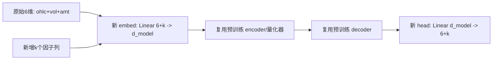

# 方案 A：扩展 Tokenizer 输入维度（把因子当作新「特征通道」）

> 思路：把基本面 / 情绪等**与价格同频的连续数值因子**拼接到原始 6 维特征之后，使
> `KronosTokenizer` 的输入维度从 `d_in=6` 扩展为 `d_in = 6 + k`，让因子直接进入「量化—重建」主链路。
>
> 适用因子：与 K 线同频、连续数值型，如 PE、PB、换手率、资金净流入、北向持股比例、行业景气指数等。
> 不适用：异频 / 文本 / 稀疏的消息面因子（请用方案 C）。

---

## 1. 原理与代价

`KronosTokenizer` 的输入侧只有两处与 `d_in` 强绑定（见 [model/kronos.py](../../model/kronos.py)）：

```python
self.embed = nn.Linear(self.d_in, self.d_model)  # 输入投影 d_in -> d_model
self.head  = nn.Linear(self.d_model, self.d_in)  # 重建投影 d_model -> d_in
```

- 把 `d_in` 从 6 改成 `6+k`，这两层的权重形状随之改变，**预训练 tokenizer 无法直接整体加载**。
- 中间的 encoder / decoder / 量化器（`quant_embed`、`post_quant_embed`、`BSQuantizer`）维度与 `d_in` 无关，**可以继续复用预训练权重**。
- 因此本方案的核心是「**权重移植（weight surgery）+ 重训 Tokenizer**」：保留中间层预训练权重，只把 `embed` / `head` 扩展并部分继承前 6 维。



---

## 2. 数据格式

### 2.1 通用列定义

在标准 Kronos CSV（`timestamps, open, high, low, close, volume, amount`）基础上，**追加 k 个因子列**。所有列与每根 K 线一一对齐、同一时间频率。

| 列名 | 含义 | 是否必需 |
| --- | --- | --- |
| `timestamps` | 时间戳（升序、唯一） | 必需 |
| `open/high/low/close` | 价格 | 必需 |
| `volume/amount` | 量、额（无则填 0） | 必需 |
| `pe` `pb` `turnover` `north_hold` ... | 自定义因子（k 个） | 本方案新增 |

> 关键要求：因子必须是「**该 K 线时间点之前已公开**」的值（防未来泄漏）。季度披露的基本面要**前向填充**到 K 线频率。

### 2.2 训练数据格式（train）

文件：`finetune_csv/data/A_000001_factorA_train.csv`（时间靠前的 80%）

```csv
timestamps,open,high,low,close,volume,amount,pe,pb,turnover,north_hold
2020/01/02,16.50,16.78,16.40,16.72,98345600,1.64e9,9.85,0.92,0.61,3.10
2020/01/03,16.70,16.95,16.61,16.88,76521000,1.29e9,9.95,0.93,0.48,3.12
2020/01/06,16.80,16.90,16.55,16.60,81233400,1.36e9,9.78,0.92,0.52,3.09
...
```

### 2.3 验证数据格式（val）

文件：`finetune_csv/data/A_000001_factorA_val.csv`（紧接训练集之后的 10%）。**列完全相同**，仅时间段不同，用于早停 / 选最优权重。

```csv
timestamps,open,high,low,close,volume,amount,pe,pb,turnover,north_hold
2024/01/02,11.20,11.35,11.10,11.28,55012300,6.18e8,5.42,0.55,0.33,4.80
...
```

### 2.4 测试数据格式（test）

文件：`finetune_csv/data/A_000001_factorA_test.csv`（最后 10%，训练 / 验证从未见过）。**列完全相同**，用于最终评估。

```csv
timestamps,open,high,low,close,volume,amount,pe,pb,turnover,north_hold
2025/06/02,12.05,12.30,11.98,12.21,61203400,7.42e8,5.88,0.60,0.41,5.05
...
```

> 切分原则：严格**按时间先后**切分（不可随机打乱），比例建议 train:val:test = 8:1:1。

### 2.5 因子归一化（重要）

价格列沿用仓库逻辑（lookback 窗口内 z-score + 裁剪 ±clip）。**因子列需单独 z-score**，避免量纲压制价格信号。建议在数据集 `__getitem__` 中对因子单独标准化（见第 4 章代码）。

---

## 3. 操作步骤

### 步骤 1：准备带因子的 CSV

用 akshare / baostock 拉价格 + 因子，对齐后前向填充，按时间切成 train/val/test 三个 CSV（格式见第 2 章）。

```python
import akshare as ak
import pandas as pd

# 价格（前复权日线）
px = ak.stock_zh_a_hist(symbol="000001", period="daily",
                        start_date="20200101", end_date="20251231", adjust="qfq")
px = px.rename(columns={"日期":"timestamps","开盘":"open","最高":"high","最低":"low",
                        "收盘":"close","成交量":"volume","成交额":"amount"})
px = px[["timestamps","open","high","low","close","volume","amount"]]
px["timestamps"] = pd.to_datetime(px["timestamps"])

# 估值因子（示例：PE/PB，按交易日）
val = ak.stock_a_indicator_lg(symbol="000001")  # 含 pe, pb, total_mv 等
val = val.rename(columns={"trade_date":"timestamps"})
val["timestamps"] = pd.to_datetime(val["timestamps"])

df = px.merge(val[["timestamps","pe","pb"]], on="timestamps", how="left")
# 换手率/北向等可继续 merge ...
df[["pe","pb"]] = df[["pe","pb"]].ffill()         # 前向填充，禁用未来值
df = df.dropna().sort_values("timestamps").reset_index(drop=True)

n = len(df)
df.iloc[:int(n*0.8)].to_csv("finetune_csv/data/A_000001_factorA_train.csv", index=False)
df.iloc[int(n*0.8):int(n*0.9)].to_csv("finetune_csv/data/A_000001_factorA_val.csv", index=False)
df.iloc[int(n*0.9):].to_csv("finetune_csv/data/A_000001_factorA_test.csv", index=False)
```

### 步骤 2：权重移植——把预训练 tokenizer 扩展到 `d_in=6+k`

新建 `finetune_csv/expand_tokenizer.py`（仓库已提供可运行版本，含 `--smoke` 自测）：

> 可先跑冲烟自测（无需任何预训练权重）：`python finetune_csv/expand_tokenizer.py --smoke`

```python
import os, json, inspect
import torch
from model import KronosTokenizer

PRETRAINED = "C:/xapproject/Quantia/Kronos/pretrained/Kronos-Tokenizer-base"
SAVE_DIR   = "C:/xapproject/Quantia/Kronos/pretrained/Kronos-Tokenizer-base-d8"
K_EXTRA    = 2   # 新增因子个数（此处以 pe, pb 为例；按你的因子数修改）

# 1) 加载预训练 tokenizer（d_in=6）
tok_old = KronosTokenizer.from_pretrained(PRETRAINED)
old_d_in = tok_old.d_in
new_d_in = old_d_in + K_EXTRA

# 2) 从预训练目录的 config.json 读取「完整且真实」的超参，仅覆盖 d_in。
#    ★ 关键：BSQ 超参（beta/gamma0/gamma/zeta/group_size 等）会影响量化器内部
#    结构（如 group_size 需满足 embed_dim % group_size == 0），绝不能手填猜测值，
#    必须沿用预训练 config，否则中间层 buffer 形状/量化行为都会出错。
with open(os.path.join(PRETRAINED, "config.json"), "r", encoding="utf-8") as f:
    cfg = json.load(f)
# 只保留 KronosTokenizer.__init__ 接受的键，避免 config.json 里的多余字段报错
valid_keys = set(inspect.signature(KronosTokenizer.__init__).parameters) - {"self"}
cfg = {k: v for k, v in cfg.items() if k in valid_keys}
cfg["d_in"] = new_d_in            # 仅覆盖输入维度
tok_new = KronosTokenizer(**cfg)

# 3) 拷贝可复用的中间层（除 embed/head 外全部同名同形）
old_sd, new_sd = tok_old.state_dict(), tok_new.state_dict()
for name, w in old_sd.items():
    if name in new_sd and new_sd[name].shape == w.shape:
        new_sd[name] = w.clone()

# 4) 部分继承 embed / head 的前 6 维，新增维度保持新建时的随机初始化
#    embed.weight: [d_model, d_in]  -> 复制前 old_d_in 列
#    embed.bias:   [d_model]        -> 直接复制
new_sd["embed.weight"][:, :old_d_in] = old_sd["embed.weight"]
new_sd["embed.bias"]                 = old_sd["embed.bias"].clone()
#    head.weight:  [d_in, d_model]  -> 复制前 old_d_in 行
#    head.bias:    [d_in]           -> 复制前 old_d_in 个
new_sd["head.weight"][:old_d_in, :]  = old_sd["head.weight"]
new_sd["head.bias"][:old_d_in]       = old_sd["head.bias"]

tok_new.load_state_dict(new_sd)
tok_new.save_pretrained(SAVE_DIR)
print(f"expanded tokenizer saved: d_in {old_d_in} -> {new_d_in} @ {SAVE_DIR}")
```

> 说明：`KronosTokenizer` 基于 `PyTorchModelHubMixin`，`save_pretrained` 会把 `__init__`
> 的全部超参写入 `config.json`。因此上面直接读取 `config.json` 并只覆盖 `d_in` 最稳妥——
> `beta / gamma0 / gamma / zeta / group_size` 等均自动沿用预训练真实值，无需手填。

### 步骤 3：扩展数据集与配置以纳入因子

修改 [finetune_csv/configs/config_ali09988_candle-5min.yaml](../../finetune_csv/configs/config_ali09988_candle-5min.yaml) 的副本，加入因子列声明，并把 `pretrained_tokenizer` 指向扩展后的目录：

```yaml
data:
  data_path: "C:/xapproject/Quantia/Kronos/finetune_csv/data/A_000001_factorA_train.csv"
  val_path:  "C:/xapproject/Quantia/Kronos/finetune_csv/data/A_000001_factorA_val.csv"   # 若加载器支持
  feature_list: ["open","high","low","close","volume","amount","pe","pb"]  # d_in=8
  lookback_window: 90
  predict_window: 10
  max_context: 512
  clip: 5.0

model_paths:
  pretrained_tokenizer: "C:/xapproject/Quantia/Kronos/pretrained/Kronos-Tokenizer-base-d8"
  pretrained_predictor: "C:/xapproject/Quantia/Kronos/pretrained/Kronos-base"
  exp_name: "A_000001_factorA"
  base_path: "C:/xapproject/Quantia/Kronos/finetune_csv/finetuned/"
```

如数据集类未读取 `feature_list`，参考 [finetune/dataset.py](../../finetune/dataset.py) 的 `QlibDataset`，把因子单独标准化：

```python
# 在 __getitem__ 中：x = win_df[self.feature_list].values  # 已含因子列
past_len = self.config.lookback_window
past = x[:past_len]
mean, std = past.mean(0), past.std(0)        # 逐列统计（价格+因子各自一套）
x = (x - mean) / (std + 1e-5)
x = np.clip(x, -self.config.clip, self.config.clip)
```

### 步骤 4：重训 Tokenizer + Predictor

```powershell
cd C:\xapproject\Quantia\Kronos\finetune_csv
# tokenizer 必须重训（embed/head 变了）；predictor 随后训练
python train_sequential.py --config configs/config_a_000001_factorA.yaml
```

> Tokenizer 因 `embed/head` 部分随机初始化，建议 `tokenizer_epochs` 适当增大（如 40+），并用验证集监控重建误差。

---

## 4. 验证与评估

### 4.1 训练前自检脚本

```python
import pandas as pd
for split in ["train","val","test"]:
    df = pd.read_csv(f"finetune_csv/data/A_000001_factorA_{split}.csv")
    cols = ["open","high","low","close","volume","amount","pe","pb"]
    assert set(cols).issubset(df.columns), f"{split} 缺列"
    assert not df[cols].isnull().any().any(), f"{split} 有 NaN"
    assert df["timestamps"].is_monotonic_increasing or True  # 已排序
    print(split, "rows", len(df), "OK")
```

### 4.2 微调后评估（在 test 集上）

```python
import pandas as pd
from model import Kronos, KronosTokenizer, KronosPredictor

tok = KronosTokenizer.from_pretrained("finetune_csv/finetuned/A_000001_factorA/tokenizer/best_model")
mdl = Kronos.from_pretrained("finetune_csv/finetuned/A_000001_factorA/basemodel/best_model")
predictor = KronosPredictor(mdl, tok, max_context=512)

# 注意：predict 默认只校验价格列。因子列需随 df 一并传入并参与归一化，
# 若沿用官方 predict，需要确认其 price_cols/feature 已扩展为含因子的 8 列；
# 否则请在自定义 generate 中按 feature_list=8 维构造 x。
```

评估指标：价格 MAE / RMSE、涨跌方向命中率；并对比「含因子 vs 不含因子」两套权重，确认因子带来的增益。

---

## 5. 优缺点与注意事项

| 优点 | 缺点 / 风险 |
| --- | --- |
| 因子进入主链路，模型可学习价量-因子联合分布 | 必须重训 tokenizer，成本高 |
| 推理路径与原模型一致，部署简单 | 预训练价格分词能力部分被打散（embed/head 重置） |
| | 仅适合同频连续数值因子；异频/文本不适用 |

注意事项：
- **防泄漏**：因子只能用已公开值；统计量（mean/std）只用 lookback 窗口。
- **因子缺失**：停牌/未披露用前值填充，必要时加「缺失标记」列（也计入 `d_in`）。
- **推理期因子可得性**：`predict` 阶段未来步的因子若不可知，需用「最后已知值前向填充」或在数据集中将预测窗口因子置为最后已知值。

---

### 关联文档
- 总览：[A股微调操作指南.md](A%E8%82%A1%E5%BE%AE%E8%B0%83%E6%93%8D%E4%BD%9C%E6%8C%87%E5%8D%97.md)
- 方案 B（条件旁路，不动 tokenizer）：[方案B_因子条件旁路.md](%E6%96%B9%E6%A1%88B_%E5%9B%A0%E5%AD%90%E6%9D%A1%E4%BB%B6%E6%97%81%E8%B7%AF.md)
- 方案 C（外部融合，不动 Kronos）：[方案C_外部融合集成.md](%E6%96%B9%E6%A1%88C_%E5%A4%96%E9%83%A8%E8%9E%8D%E5%90%88%E9%9B%86%E6%88%90.md)
