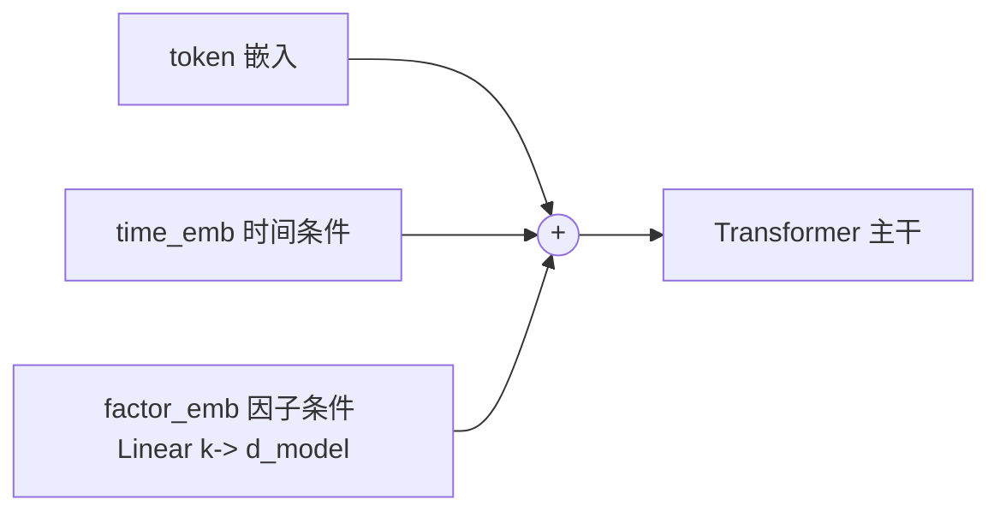

# 方案 B：因子条件旁路（仿时间嵌入注入额外条件）

> 思路：Kronos 主模型本就有一条**不经过 tokenizer 的条件通路**——`TemporalEmbedding`（把
> minute/hour/weekday/day/month 投影到 `d_model` 后与 token 嵌入相加）。本方案**新增一个
> `FactorEmbedding`**，把因子向量同样投影到 `d_model` 与 token 嵌入相加，从而在**完全不改动
> tokenizer（`d_in` 仍为 6）**的前提下，让主模型「看到」因子条件。
>
> 适用因子：中等维度、连续/可数值化的条件向量（基本面、技术指标、可数值化的情绪分值）。
> 优点：保留预训练价格分词能力，只改主模型与数据集；改造量适中，是「平衡之选」。

---

## 1. 原理

主模型 `Kronos.forward`（见 [model/kronos.py](../../model/kronos.py)）的嵌入融合部分：

```python
x = self.embedding([s1_ids, s2_ids])      # token 嵌入 [B, T, d_model]
if stamp is not None:
    time_embedding = self.time_emb(stamp) # 时间条件
    x = x + time_embedding                # 相加注入
```

我们在此基础上再加一项 `factor_embedding`：

```python
x = self.embedding([s1_ids, s2_ids]) + self.time_emb(stamp) + self.factor_emb(factor)
```

其中 `self.factor_emb = nn.Linear(k, d_model)`，`factor` 形状 `[B, T, k]`。
token 嵌入路径与量化器完全不变 → **预训练 tokenizer 权重 100% 复用**。



> 因子嵌入是「**加性条件**」：新增的 `factor_emb` 初始权重置 0 时，模型等价于原始 Kronos，
> 训练中逐步学到因子的边际贡献，收敛更稳、不易破坏预训练能力。

---

## 2. 数据格式

价格列与标准 Kronos CSV 相同；**新增 k 个因子列**，与每根 K 线对齐。与方案 A 的 CSV 列结构一致，区别在于**因子不进 tokenizer，而是单独成张量传入主模型**。

### 2.1 通用列定义

| 列名 | 含义 | 用途 |
| --- | --- | --- |
| `timestamps, open, high, low, close, volume, amount` | 标准 K 线 | 进 tokenizer（6 维） |
| `f_pe, f_pb, f_turnover, f_sent` ... | k 个因子 | 进 `factor_emb`（条件） |

> 命名建议给因子列统一前缀（如 `f_`），便于在数据集里用前缀筛选 `factor_list`。

### 2.2 训练数据格式（train）

文件：`finetune_csv/data/A_000001_factorB_train.csv`（按时间靠前 80%）

```csv
timestamps,open,high,low,close,volume,amount,f_pe,f_pb,f_turnover,f_sent
2020/01/02,16.50,16.78,16.40,16.72,98345600,1.64e9,9.85,0.92,0.61,0.20
2020/01/03,16.70,16.95,16.61,16.88,76521000,1.29e9,9.95,0.93,0.48,0.05
...
```

- `f_sent` 为可数值化情绪分（如新闻情感得分归一到 [-1,1]）。
- **未来步因子可得性**：训练时整段已知；推理时若预测窗口的因子未知，用「最后已知值前向填充」或置 0（见第 4.3 节）。

### 2.3 验证数据格式（val）

文件：`finetune_csv/data/A_000001_factorB_val.csv`（紧接训练集的 10%），列与 train **完全相同**，仅时间段不同；用于早停与选最优。

### 2.4 测试数据格式（test）

文件：`finetune_csv/data/A_000001_factorB_test.csv`（最后 10%），列与 train **完全相同**；用于最终评估，全程不参与训练 / 选模型。

> 三份文件列名、列序必须一致；严格按时间切分，禁止随机打乱。

---

## 3. 代码改造

### 3.1 给主模型加 `FactorEmbedding`（最小侵入子类）

新建 `finetune_csv/factor_model.py`，用子类扩展而**不改动仓库原文件**（仓库已提供可运行版本，含 `--smoke` 自测）：

> 可先跑冲烟自测（无需预训练权重，验证零初始化等价性）：`python finetune_csv/factor_model.py --smoke`

```python
import torch
import torch.nn as nn
import torch.nn.functional as F
from model.kronos import Kronos


class KronosWithFactor(Kronos):
    """在原始 Kronos 上新增一路加性因子条件嵌入。"""

    def init_factor(self, factor_dim: int):
        # 单独初始化，避免影响 from_pretrained 的权重加载
        self.factor_dim = factor_dim
        self.factor_emb = nn.Linear(factor_dim, self.d_model)
        # 关键：权重/偏置置 0 -> 初始等价于原始 Kronos，训练中再学增量
        nn.init.zeros_(self.factor_emb.weight)
        nn.init.zeros_(self.factor_emb.bias)

    def forward(self, s1_ids, s2_ids, stamp=None, factor=None,
                padding_mask=None, use_teacher_forcing=False, s1_targets=None):
        x = self.embedding([s1_ids, s2_ids])
        if stamp is not None:
            x = x + self.time_emb(stamp)
        if factor is not None:                       # 新增：因子条件旁路
            x = x + self.factor_emb(factor)
        x = self.token_drop(x)

        for layer in self.transformer:
            x = layer(x, key_padding_mask=padding_mask)
        x = self.norm(x)

        s1_logits = self.head(x)
        if use_teacher_forcing:
            sibling_embed = self.embedding.emb_s1(s1_targets)
        else:
            s1_probs = F.softmax(s1_logits.detach(), dim=-1)
            sample_s1_ids = torch.multinomial(
                s1_probs.view(-1, self.s1_vocab_size), 1).view(s1_ids.shape)
            sibling_embed = self.embedding.emb_s1(sample_s1_ids)

        x2 = self.dep_layer(x, sibling_embed, key_padding_mask=padding_mask)
        s2_logits = self.head.cond_forward(x2)
        return s1_logits, s2_logits


def load_with_factor(pretrained_predictor: str, factor_dim: int):
    """加载预训练主模型权重，并挂上零初始化的因子嵌入。"""
    model = KronosWithFactor.from_pretrained(pretrained_predictor)
    model.init_factor(factor_dim)
    return model
```

### 3.2 数据集返回因子张量

> 仓库已提供可运行的数据集 + 训练入口 `finetune_csv/train_factor_model.py`（含 `FactorKlineDataset` 与单卡训练循环，并带 `--smoke` 自测）：`python finetune_csv/train_factor_model.py --smoke`。以下为核心逻辑示意。

参考 [finetune/dataset.py](../../finetune/dataset.py)，在窗口切片时**额外取因子列**并单独标准化：

```python
# config 中新增： self.factor_list = ['f_pe','f_pb','f_turnover','f_sent']
class FactorDataset(QlibDataset):     # 或直接在自定义数据集中实现
    def __getitem__(self, idx):
        symbol, start_idx = self.indices[self.py_rng.randint(0, len(self.indices)-1)]
        df = self.data[symbol]
        win = df.iloc[start_idx:start_idx + self.window]

        x       = win[self.feature_list].values.astype('float32')        # 6 维 -> tokenizer
        x_stamp = win[self.time_feature_list].values.astype('float32')   # 时间特征
        factor  = win[self.config.factor_list].values.astype('float32')  # k 维 -> 因子条件

        # 价格：lookback 窗口内 z-score + 裁剪
        past = x[:self.config.lookback_window]
        m, s = past.mean(0), past.std(0)
        x = ((x - m) / (s + 1e-5)).clip(-self.config.clip, self.config.clip)

        # 因子：单独 z-score（同样只用 lookback 统计，防泄漏）
        fm, fs = factor[:self.config.lookback_window].mean(0), factor[:self.config.lookback_window].std(0)
        factor = ((factor - fm) / (fs + 1e-5)).clip(-self.config.clip, self.config.clip)

        return (torch.from_numpy(x), torch.from_numpy(x_stamp), torch.from_numpy(factor))
```

### 3.3 训练循环（在 finetune_base_model 的基础上加 factor）

核心改动：tokenizer 仍只编码 6 维价格；factor 与 stamp 一起传入主模型。

```python
# 与仓库 finetune_base_model.py 一致：DDP 下需经 model.module 取子模块
import torch.distributed as dist
use_ddp = dist.is_available() and dist.is_initialized()
core = lambda m: (m.module if use_ddp else m)   # 取真实模型（兼容单卡/DDP）

for batch_x, batch_x_stamp, batch_factor in train_loader:
    batch_x        = batch_x.to(device)
    batch_x_stamp  = batch_x_stamp.to(device)
    batch_factor   = batch_factor.to(device)

    with torch.no_grad():
        token_seq_0, token_seq_1 = tokenizer.encode(batch_x, half=True)  # tokenizer 不变

    token_in  = [token_seq_0[:, :-1], token_seq_1[:, :-1]]
    token_out = [token_seq_0[:, 1:],  token_seq_1[:, 1:]]

    # 关键：stamp 与 factor 都对齐到「输入端」长度 [:, :-1, :]
    #   DDP 会把额外的关键字参数 factor= 透传给子模块 forward，可正常工作
    logits = model(token_in[0], token_in[1],
                   stamp=batch_x_stamp[:, :-1, :],
                   factor=batch_factor[:, :-1, :])
    loss, s1_loss, s2_loss = core(model).head.compute_loss(
        logits[0], logits[1], token_out[0], token_out[1])

    optimizer.zero_grad(); loss.backward()
    torch.nn.utils.clip_grad_norm_(model.parameters(), 3.0)
    optimizer.step(); scheduler.step()
```

> 说明：Tokenizer **无需重训**（可直接用官方预训练）。只需微调主模型（含新增 `factor_emb`）。
> 因 `factor_emb` 零初始化，前几个 step 行为与原模型一致，训练更稳。

### 3.4 推理（自回归时逐步提供因子）

仿照 `auto_regressive_inference`（[model/kronos.py](../../model/kronos.py)），在每步把对应时刻的 `factor` 切片随 `stamp` 一起喂入。未来步因子未知时，用最后已知值前向填充（见 4.3）。

---

## 4. 验证与评估

### 4.1 等价性自检（factor_emb 置 0 时应与原模型一致）

```python
from finetune_csv.factor_model import load_with_factor
import torch

m = load_with_factor("pretrained/Kronos-base", factor_dim=4).eval()
s1 = torch.randint(0, 2, (1, 16)); s2 = torch.randint(0, 2, (1, 16))
stamp = torch.zeros(1, 16, 5).long()
f = torch.randn(1, 16, 4)
with torch.no_grad():
    a = m(s1, s2, stamp=stamp, factor=None)      # 不给因子
    b = m(s1, s2, stamp=stamp, factor=f)         # 给因子（但 emb 权重为0）
print(torch.allclose(a[0], b[0], atol=1e-5))     # 期望 True（初始等价）
```

### 4.2 数据自检

```python
import pandas as pd
factor_cols = ["f_pe","f_pb","f_turnover","f_sent"]
for split in ["train","val","test"]:
    df = pd.read_csv(f"finetune_csv/data/A_000001_factorB_{split}.csv")
    need = ["open","high","low","close","volume","amount"] + factor_cols
    assert set(need).issubset(df.columns) and not df[need].isnull().any().any()
    print(split, len(df), "OK")
```

### 4.3 推理期因子缺失处理

```python
# 预测窗口的未来因子通常不可知 -> 用最后一个已知值前向填充
last_known = hist_factor[-1]                       # [k]
future_factor = np.tile(last_known, (pred_len, 1)) # [pred_len, k]
# 季度基本面变化慢，前向填充合理；高频情绪建议置 0（标准化后中性）
```

### 4.4 评估指标

- 价格 MAE / RMSE、方向命中率（在 test 集）。
- **消融对比**：`factor=None`（关闭因子）vs 正常传入，量化因子增益。

---

## 5. 优缺点

| 优点 | 缺点 / 风险 |
| --- | --- |
| 不动 tokenizer，预训练价量分词能力完整保留 | 需改主模型 forward 与训练/推理循环 |
| 零初始化加性条件，收敛稳、不易遗忘 | 因子作为「加性偏置」，表达力弱于方案 A 的联合分词 |
| 适合中等维度连续因子 | 推理需为未来步提供因子（缺失需填充策略） |

---

### 关联文档
- 总览：[A股微调操作指南.md](A%E8%82%A1%E5%BE%AE%E8%B0%83%E6%93%8D%E4%BD%9C%E6%8C%87%E5%8D%97.md)
- 方案 A（扩展 d_in，进 tokenizer）：[方案A_扩展Tokenizer输入维度.md](%E6%96%B9%E6%A1%88A_%E6%89%A9%E5%B1%95Tokenizer%E8%BE%93%E5%85%A5%E7%BB%B4%E5%BA%A6.md)
- 方案 C（外部融合，不动 Kronos）：[方案C_外部融合集成.md](%E6%96%B9%E6%A1%88C_%E5%A4%96%E9%83%A8%E8%9E%8D%E5%90%88%E9%9B%86%E6%88%90.md)
