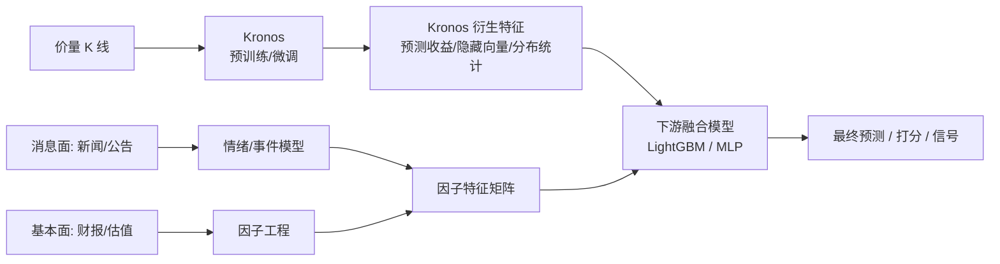

# 方案 C：外部融合 / 集成（不改动 Kronos，工程最稳）

> 思路：把 Kronos 当作**纯「价量编码 / 预测器」**，因子模型独立存在，在**下游**做融合。
> 完全不改 Kronos 的权重与结构，因此最稳、风险最低，且天然支持**异频、文本、稀疏**的消息面因子。
>
> 两种子方案：
> - **C1 特征融合**：抽取 Kronos 的中间表示 / 预测衍生特征，与因子拼接后接轻量模型（LightGBM / MLP）。
> - **C2 信号集成**：Kronos 预测涨跌 / 分布，因子模型独立出信号，两者加权或 stacking。
>
> 推荐：**消息面（NLP 情绪、事件）+ 基本面混合场景首选本方案**。

---

## 1. 架构



- Kronos 输出三类可用特征：
  1. **预测衍生**：未来 N 步预测收益率、预测波动率、上涨概率（采样多条路径统计）。
  2. **隐藏表示**：主干最后一层对最后时刻的 `d_model` 向量（需取主干隐状态）。
  3. **重建/置信**：多次采样的方差作为不确定性特征。
- 因子侧独立产出特征矩阵（任意频率，按日期对齐）。
- 下游模型（推荐 LightGBM）吃「Kronos 特征 ⊕ 因子特征」预测标签。

---

## 2. 数据格式

本方案有**三类文件**：价量 CSV（喂 Kronos）、因子表（任意频率）、标签表（监督目标）。三者按 `date`（与 `symbol`）对齐。

### 2.1 价量 CSV（Kronos 标准输入，不变）

`finetune_csv/data/A_000001_daily.csv`：

```csv
timestamps,open,high,low,close,volume,amount
2020/01/02,16.50,16.78,16.40,16.72,98345600,1.64e9
2020/01/03,16.70,16.95,16.61,16.88,76521000,1.29e9
...
```

### 2.2 因子表（可异频，按日期对齐）

`data/factors_000001.csv`（基本面 + 消息面，缺失允许，后续对齐时前向填充）：

```csv
date,symbol,pe,pb,roe,north_hold,news_sent,news_count,event_flag
2020-01-02,000001,9.85,0.92,0.121,3.10,0.20,12,0
2020-01-03,000001,9.95,0.93,0.121,3.12,-0.05,8,0
2020-01-06,000001,9.78,0.92,0.121,3.09,0.40,21,1
...
```

> - `roe` 季度更新 → 对齐到日频时**前向填充**。
> - `news_sent` 为当日新闻情感均值（[-1,1]），`news_count` 为新闻条数，`event_flag` 为是否有重大事件（0/1）。
> - 所有因子必须是「当日收盘前可得」的信息（防未来泄漏）。

### 2.3 监督特征 / 标签表（下游模型直接使用）

由脚本生成的「**每个样本一行**」的宽表，包含 Kronos 特征 + 因子特征 + 标签：

`data/fusion_dataset.csv`：

```csv
date,symbol,k_pred_ret,k_up_prob,k_pred_vol,pe,pb,roe,north_hold,news_sent,news_count,event_flag,label_fwd_ret_5d
2020-02-10,000001,0.012,0.61,0.018,9.90,0.93,0.121,3.20,0.15,10,0,0.023
2020-02-11,000001,-0.004,0.47,0.021,9.82,0.92,0.121,3.18,-0.10,7,0,-0.011
...
```

| 字段组 | 字段 | 来源 |
| --- | --- | --- |
| 索引 | `date, symbol` | 对齐键 |
| Kronos 特征 | `k_pred_ret`（预测收益）、`k_up_prob`（上涨概率）、`k_pred_vol`（预测波动） | Kronos 推理统计 |
| 因子特征 | `pe, pb, roe, north_hold, news_sent, news_count, event_flag` | 因子表 |
| 标签 | `label_fwd_ret_5d`（未来 5 日收益）或涨跌 0/1 | 由价格未来值计算 |

### 2.4 训练 / 验证 / 测试切分

对 `fusion_dataset.csv` **按时间先后**切分（禁止随机打乱、禁止跨期泄漏）：

| 切分 | 文件 | 时间范围（示例） | 用途 |
| --- | --- | --- | --- |
| 训练 | `fusion_train.csv` | 2020-01 ~ 2023-12 | 训练下游模型 |
| 验证 | `fusion_val.csv` | 2024-01 ~ 2024-12 | 调参 / 早停 |
| 测试 | `fusion_test.csv` | 2025-01 ~ 2025-06 | 最终评估（含回测） |

三个文件**列结构完全相同**，仅 `date` 范围不同。

---

## 3. 操作步骤

### 步骤 1：用 Kronos 批量生成衍生特征

`finetune_csv/build_kronos_features.py`（仓库已提供可运行版本，含 `--smoke` 自测：`python finetune_csv/build_kronos_features.py --smoke`）：

```python
import numpy as np, pandas as pd
from model import Kronos, KronosTokenizer, KronosPredictor

tok = KronosTokenizer.from_pretrained("pretrained/Kronos-Tokenizer-base")
mdl = Kronos.from_pretrained("pretrained/Kronos-base")        # 或你微调后的权重
predictor = KronosPredictor(mdl, tok, max_context=512)

px = pd.read_csv("finetune_csv/data/A_000001_daily.csv")
px["timestamps"] = pd.to_datetime(px["timestamps"])

LOOKBACK, PRED, SAMPLES = 90, 5, 30
rows = []
for end in range(LOOKBACK, len(px) - PRED):
    hist = px.iloc[end-LOOKBACK:end]
    x_df = hist[["open","high","low","close","volume","amount"]].reset_index(drop=True)
    x_ts = hist["timestamps"].reset_index(drop=True)
    y_ts = px["timestamps"].iloc[end:end+PRED].reset_index(drop=True)

    # 多次采样 -> 统计预测收益、上涨概率、预测波动
    preds = []
    for _ in range(SAMPLES):
        pred_df = predictor.predict(df=x_df, x_timestamp=x_ts, y_timestamp=y_ts,
                                    pred_len=PRED, T=1.0, top_p=0.9, sample_count=1, verbose=False)
        preds.append(pred_df["close"].values)
    preds = np.array(preds)                                   # [SAMPLES, PRED]
    last_close = x_df["close"].iloc[-1]
    fwd_ret = preds[:, -1] / last_close - 1.0                # 每条路径的 N 步收益
    rows.append({
        "date": px["timestamps"].iloc[end].date(),
        "symbol": "000001",
        "k_pred_ret": float(fwd_ret.mean()),
        "k_up_prob": float((fwd_ret > 0).mean()),
        "k_pred_vol": float(np.std(preds[:, -1] / last_close)),
    })

pd.DataFrame(rows).to_csv("data/kronos_features_000001.csv", index=False)
print("kronos features saved")
```

> 提示：批量股票用 `predict_batch`（[model/kronos.py](../../model/kronos.py)）一次预测多只，效率更高。

### 步骤 2：对齐因子 + Kronos 特征 + 标签 → 宽表

`finetune_csv/build_fusion_dataset.py`（仓库已提供可运行版本，含按 symbol 分组算标签 + 防氄漏的时间切分，含 `--smoke` 自测：`python finetune_csv/build_fusion_dataset.py --smoke`）：

```python
import pandas as pd

kf = pd.read_csv("data/kronos_features_000001.csv", parse_dates=["date"])
ff = pd.read_csv("data/factors_000001.csv", parse_dates=["date"])
px = pd.read_csv("finetune_csv/data/A_000001_daily.csv")
px["date"] = pd.to_datetime(px["timestamps"]).dt.normalize()

# 标签：未来 5 日收益（用真实价格，确保对齐到样本当日）
px = px.sort_values("date").reset_index(drop=True)
px["label_fwd_ret_5d"] = px["close"].shift(-5) / px["close"] - 1.0

df = (kf.merge(ff, on=["date","symbol"], how="left")
        .merge(px[["date","label_fwd_ret_5d"]], on="date", how="left"))
df[["roe","pe","pb"]] = df[["roe","pe","pb"]].ffill()          # 慢变因子前向填充
df["news_sent"] = df["news_sent"].fillna(0.0)                   # 无新闻 -> 中性
df["news_count"] = df["news_count"].fillna(0)
df["event_flag"] = df["event_flag"].fillna(0)
df = df.dropna(subset=["label_fwd_ret_5d"]).reset_index(drop=True)

# 按时间切分
df = df.sort_values("date")
tr = df[df.date < "2024-01-01"]
va = df[(df.date >= "2024-01-01") & (df.date < "2025-01-01")]
te = df[df.date >= "2025-01-01"]
tr.to_csv("data/fusion_train.csv", index=False)
va.to_csv("data/fusion_val.csv", index=False)
te.to_csv("data/fusion_test.csv", index=False)
print(len(tr), len(va), len(te))
```

### 步骤 3a（C1，主线）：训练下游融合模型（LightGBM 回归）

> C1 特征融合是**工程主线**：把 Kronos 衍生特征 ⊕ 因子特征喂给单个下游模型，能吃到 `k_pred_ret × roe` 等交叉项。下面是底层原理示意，步骤 3c 的脚本已将其与 C2 兜底、自动选型一并封装。

```python
import numpy as np, pandas as pd, lightgbm as lgb

feat = ["k_pred_ret","k_up_prob","k_pred_vol",
        "pe","pb","roe","north_hold","news_sent","news_count","event_flag"]
tgt = "label_fwd_ret_5d"

tr = pd.read_csv("data/fusion_train.csv")
va = pd.read_csv("data/fusion_val.csv")
te = pd.read_csv("data/fusion_test.csv")

model = lgb.LGBMRegressor(n_estimators=600, learning_rate=0.03,
                          num_leaves=31, subsample=0.8, colsample_bytree=0.8)
model.fit(tr[feat], tr[tgt],
          eval_set=[(va[feat], va[tgt])],
          callbacks=[lgb.early_stopping(50), lgb.log_evaluation(50)])

pred = model.predict(te[feat])
# 直接用 numpy 计算 RMSE，避免不同 sklearn 版本对 mean_squared_error(squared=)
# 参数的兼容性差异（新版已移除该参数）
rmse = float(np.sqrt(np.mean((te[tgt].values - pred) ** 2)))
print("test RMSE:", rmse)
print("方向命中率:", ((pred > 0) == (te[tgt] > 0)).mean())
# 特征重要性可看 Kronos 特征 vs 因子各自贡献
print(dict(zip(feat, model.feature_importances_)))
```

> C2（信号集成）作为**对照与兜底**，不必手写——已封装进步骤 3c 的脚本：Kronos 单独出一路预测、因子单独出一路预测，再用「加权（val 上搜 alpha）」或「stacking（val 上训线性元模型）」融合。**所有组合器参数只在验证集上确定**，无需也不应手动准备 `factor_score` 等列。

### 步骤 3c：一键对比 + 自动选型（主线 C1 / 兜底 C2）

`finetune_csv/compare_fusion_strategies.py`（仓库已提供可运行版本，含 `--smoke` 自测：`python finetune_csv/compare_fusion_strategies.py --smoke`）在**同一份融合数据**上同时跑 C1、C2（加权）、C2（stacking），严格遵循工程最佳实践：

- **train 训基模型 → val 调组合器并选型 → test 仅最终评估**：选型只看**验证集 IC**，杜绝「在测试集上挑方案」的选择泄漏。
- **以 C1 为主线**：默认产出 C1 特征融合；仅当某个 C2 方案的**验证集 IC ≥ C1 + `--switch-threshold`**（默认 0.005）时，才作为**兜底**切换上位，避免噪声波动导致频繁换线。
- 输出 val 与 test 两张指标表（RMSE / IC / RankIC / 方向命中率）、最终生产策略及切换理由；下游模型优先 LightGBM，未安装则回退 numpy Ridge。
- 可用 `--out-json` 将选型结果与指标落盘，供生产流水线读取。

真实使用：

```bash
python finetune_csv/compare_fusion_strategies.py \
    --train data/fusion_train.csv --val data/fusion_val.csv --test data/fusion_test.csv \
    --kronos-cols k_pred_ret,k_up_prob,k_pred_vol \
    --factor-cols pe,pb,roe,north_hold,news_sent,news_count,event_flag \
    --label label_fwd_ret_5d \
    --switch-threshold 0.005 \
    --out-json data/fusion_selection.json
```

**结论（理论 + 合成数据实证一致）**：

| 场景 | 推荐 |
| --- | --- |
| 样本充足、因子与价量存在**交互效应**（A 股日频常见） | **C1 特征融合**（能吃到 `k_pred_ret × roe` 等交叉项，上限更高）⭐ |
| 样本少 / 因子异频稀疏（尤其消息面）/ 要求线上极稳可快速降级 | **C2 信号集成**（自由度小、最稳健，stacking 优于纯加权） |
| 工程最佳实践 | **以 C1 为主线**，C2（尤其 stacking）作为对照与兜底集成 |

> 选型在**验证集**上完成，C1 为默认主线，C2 仅在 val 上显著超阈值时兜底上位；测试集只用于汇报最终指标。**最终以你真实数据上该脚本的 val/test 指标为准**——把 `fusion_*.csv` 传入即可得到针对你数据的结论。

### 步骤 4：生产编排与部署（`run_fusion.py`，C1 主线服务入口）

前面 1~3 步是离线分析；真正**上线服务**用 `finetune_csv/run_fusion.py`，它把「Kronos 特征 → 因子对齐 → C1 下游模型训练 → 打包 → 服务预测」串成一条可部署主线（含 `smoke` 自测：`python finetune_csv/run_fusion.py smoke`）。

**① 训练并打包模型 bundle：**

```bash
python finetune_csv/run_fusion.py train \
    --price-csv finetune_csv/data/A_000001_daily.csv \
    --factors data/factors_000001.csv \
    --tokenizer pretrained/Kronos-Tokenizer-base \
    --predictor pretrained/Kronos-base \
    --out-bundle runs/fusion_000001 \
    --symbol 000001 --lookback 90 --pred 5 --samples 30 --horizon 5 \
    --train-end 2024-01-01 --val-end 2025-01-01
```

产出的 **bundle 目录**即可部署，内容：

| 文件 | 说明 |
| --- | --- |
| `manifest.json` | 元信息：后端、特征列顺序、`lookback/pred/samples/horizon`、tokenizer/主模型路径、val/test 指标 |
| `c1_lgb.txt` 或 `c1_ridge.npz` | 下游 C1 模型权重（LightGBM 原生格式 / numpy Ridge 参数） |

**② 上线预测最新一天的未来走势：**

```bash
python finetune_csv/run_fusion.py predict \
    --bundle runs/fusion_000001 \
    --price-csv finetune_csv/data/A_000001_daily.csv \
    --factors data/factors_000001.csv \
    --out-json runs/fusion_000001/latest_prediction.json
```

输出示例（对未来 `horizon` 日收益的方向与幅度）：

```json
{
  "as_of_date": "2025-06-20", "symbol": "000001", "horizon_days": 5,
  "pred_fwd_ret": 0.0123, "direction": "up",
  "k_up_prob": 0.62, "k_pred_vol": 0.018, "backend": "ridge"
}
```

> 服务时只需历史价量（≥ `lookback` 根）+ 当日可得因子；脚本自动外推未来时间戳（频率无关），对最新窗口多次采样 → C1 打分 → 给出走势预测。

### 部署形态与环境

- **环境要求**：Python 3.10+ + PyTorch（CPU 即可，本机实测 `torch 2.12.1+cpu`）即可推理；`lightgbm` 可选——未安装时 C1 自动回退 numpy Ridge（无任何功能缺失，已实测）。仓库脚本用 **LightGBM 原生 `lgb.train` API（无需 scikit-learn）**；步骤 3a 内联示例里的 `LGBMRegressor` 是 sklearn 封装，才需额外装 scikit-learn。GPU 仅加速 Kronos 推理（多采样耗时大头），非必需。
- **离线批量打分（推荐起步）**：用 crontab / 任务计划在收盘后跑一次 `run_fusion.py predict`，把 `latest_prediction.json` 落库或推到下游选股 / 回测。
- **常驻服务**：把 `load_bundle` + `predict_latest` 包一层 Flask/FastAPI 接口（本仓 `webui/` 已有 Flask 范式可参考）；**进程启动时加载一次 tokenizer/主模型/bundle**，请求时只跑推理，避免每次重载权重。
- **多标的**：对每只股票各训一个 bundle（`--symbol` 区分目录），或扩展为批量循环；大批量预测可改用 `KronosPredictor.predict_batch` 提速。
- **更新节奏**：价量每日增量即可重打 Kronos 特征；C1 下游模型建议按月 / 季滚动重训（`train` 重跑覆盖 bundle），并用步骤 3c 的对照脚本定期复核 C1 是否仍优于 C2 兜底。
- **防泄漏铁律**：线上预测当日只能用「收盘前可得」的因子；标签与选型口径必须与训练一致（见 4.2）。

---

## 4. 验证与评估

### 4.1 数据自检

```python
import pandas as pd
feat = ["k_pred_ret","k_up_prob","k_pred_vol","pe","pb","roe",
        "north_hold","news_sent","news_count","event_flag"]
for split in ["train","val","test"]:
    df = pd.read_csv(f"data/fusion_{split}.csv")
    assert set(feat + ["label_fwd_ret_5d","date"]).issubset(df.columns)
    assert not df[feat].isnull().any().any(), f"{split} 因子有 NaN"
    print(split, len(df), "日期范围", df.date.min(), "~", df.date.max())
```

### 4.2 防泄漏检查（关键）

- [ ] 标签 `label_fwd_ret_5d` 用的是**样本日之后**的价格（`shift(-5)`），特征只用样本日及之前信息。
- [ ] 训练 / 验证 / 测试**按时间不重叠**切分。
- [ ] 季度因子前向填充，不得使用「披露日之后才知道」的数值回填到披露前。
- [ ] **方案选型（C1 vs C2 / alpha / stacking 元模型）只在验证集上确定，测试集仅用于最终评估**——禁止按 test 指标挑方案（选择泄漏）。

### 4.3 评估指标

- **回归**：RMSE / IC（信息系数）/ RankIC。
- **分类**：方向命中率、AUC。
- **回测**：用测试集信号做组合回测（年化、夏普、最大回撤），对比「仅 Kronos」「仅因子」「融合」三组，验证融合增益。

---

## 5. 优缺点

| 优点 | 缺点 / 风险 |
| --- | --- |
| 完全不改 Kronos，零结构风险，最易落地 | Kronos 与因子非端到端联合优化，可能非全局最优 |
| 天然支持异频 / 文本 / 稀疏因子（消息面首选） | 需额外维护 Kronos 特征抽取 + 下游模型两套流程 |
| 各模块可分别正则、分别迭代，过拟合风险低 | Kronos 特征抽取需大量推理（多采样耗时） |
| 可解释性好（特征重要性看各源贡献） | 信号融合权重需谨慎调参，避免在测试集上调 |

---

### 关联文档
- 总览：[A股微调操作指南.md](A%E8%82%A1%E5%BE%AE%E8%B0%83%E6%93%8D%E4%BD%9C%E6%8C%87%E5%8D%97.md)
- **逐步操作手册（runbook）：[方案C操作指南_数据到训练验证测试.md](%E6%96%B9%E6%A1%88C%E6%93%8D%E4%BD%9C%E6%8C%87%E5%8D%97_%E6%95%B0%E6%8D%AE%E5%88%B0%E8%AE%AD%E7%BB%83%E9%AA%8C%E8%AF%81%E6%B5%8B%E8%AF%95.md)** —— 照着敲的命令级操作指南
- 方案 A（扩展 d_in，进 tokenizer）：[方案A_扩展Tokenizer输入维度.md](%E6%96%B9%E6%A1%88A_%E6%89%A9%E5%B1%95Tokenizer%E8%BE%93%E5%85%A5%E7%BB%B4%E5%BA%A6.md)
- 方案 B（条件旁路，不动 tokenizer）：[方案B_因子条件旁路.md](%E6%96%B9%E6%A1%88B_%E5%9B%A0%E5%AD%90%E6%9D%A1%E4%BB%B6%E6%97%81%E8%B7%AF.md)
