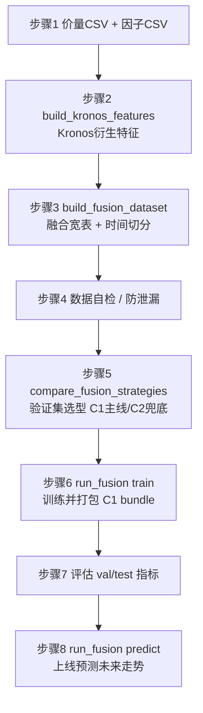

# 方案 C 操作指南：从数据集到训练 / 验证 / 测试 / 上线（逐步执行版）

> 本文是**可照着敲的操作手册**（runbook），把方案 C（外部融合 / C1 主线）的全流程拆成可复制粘贴的命令。
> 设计原理与字段含义见 [方案C_外部融合集成.md](方案C_外部融合集成.md)；本文只讲**怎么一步步做**。
>
> 适用环境：Windows + 仓库根目录 `.venv` 虚拟环境（CPU 即可）。命令中的 Python 一律用 `.\.venv\Scripts\python.exe`。

---

## 0. 全流程总览



| 步骤 | 脚本 | 产物 | 自测命令 |
| --- | --- | --- | --- |
| 1 数据准备 | —（你提供） | 价量 CSV、因子 CSV | — |
| 2 生成 Kronos 特征 | `build_kronos_features.py` | `kronos_features_*.csv` | `... build_kronos_features.py --smoke` |
| 3 融合 + 切分 | `build_fusion_dataset.py` | `fusion_{all,train,val,test}.csv` | `... build_fusion_dataset.py --smoke` |
| 4 数据自检 | 内联脚本（本文 4 节） | 校验通过 | — |
| 5 选型 | `compare_fusion_strategies.py` | `fusion_selection.json` | `... compare_fusion_strategies.py --smoke` |
| 6 训练打包 | `run_fusion.py train` | bundle 目录 | `... run_fusion.py smoke` |
| 7 评估 | 训练日志 / bundle 的 `manifest.json` | val/test 指标 | — |
| 8 上线预测 | `run_fusion.py predict` | `latest_prediction.json` | 同上 smoke |

> **建议先把 5 个 `--smoke` 跑一遍**（见第 9 节），确认环境无误后再上真实数据。

---

## 1. 环境准备

```powershell
# 进入仓库根目录
cd C:\xapproject\Quantia\Kronos

# 激活虚拟环境（PowerShell）
Set-ExecutionPolicy -Scope Process -ExecutionPolicy RemoteSigned
.\.venv\Scripts\Activate.ps1

# 确认依赖（必需 torch；lightgbm 可选，未装自动回退 numpy Ridge）
.\.venv\Scripts\python.exe -c "import torch; print('torch', torch.__version__, 'cuda', torch.cuda.is_available())"
```

- **CPU 即可推理**（实测 `torch 2.x+cpu`）。GPU 仅加速 Kronos 多采样，非必需。
- **预训练权重**：方案 C 把 Kronos 当纯预测器，需要一份 tokenizer + 主模型。可用官方 `NeoQuasar/Kronos-Tokenizer-base` + `NeoQuasar/Kronos-base`，或你微调后的本地权重目录（下文以 `pretrained/Kronos-Tokenizer-base`、`pretrained/Kronos-base` 占位）。

---

## 2. 步骤 1：准备两类输入数据

方案 C 需要**两份你自备的 CSV**（标签由脚本从价格自动计算，无需单独提供）。

### 2.1 价量 CSV（喂 Kronos）

列固定为 `timestamps,open,high,low,close,volume,amount`：

```csv
timestamps,open,high,low,close,volume,amount
2020/01/02,16.50,16.78,16.40,16.72,98345600,1.64e9
2020/01/03,16.70,16.95,16.61,16.88,76521000,1.29e9
```

> 仓库自带样例可直接试跑：`examples/data/000807_stock_data.csv`、`finetune_csv/data/HK_ali_09988_kline_5min_all.csv`。

### 2.2 因子 CSV（基本面 / 消息面，可异频）

列含对齐键 `date,symbol` + 任意因子，缺失允许（后续按规则填充）：

```csv
date,symbol,pe,pb,roe,north_hold,news_sent,news_count,event_flag
2020-01-02,000001,9.85,0.92,0.121,3.10,0.20,12,0
2020-01-03,000001,9.95,0.93,0.121,3.12,-0.05,8,0
```

- 慢变因子（`pe/pb/roe/north_hold`）→ 对齐时**前向填充**。
- 新闻 / 事件类（`news_sent/news_count/event_flag`）→ 缺失填 **0**。
- **所有因子必须是「当日收盘前可得」**（防未来泄漏）。

> 没有现成因子？可先只用价量跑通：把因子 CSV 做成只含 `date,symbol` 两列（或几个简单因子），流程同样成立，C1 退化为只吃 Kronos 特征。

---

## 3. 步骤 2：用 Kronos 批量生成衍生特征

```powershell
.\.venv\Scripts\python.exe finetune_csv\build_kronos_features.py `
    --price-csv finetune_csv\data\A_000001_daily.csv `
    --tokenizer pretrained\Kronos-Tokenizer-base `
    --predictor pretrained\Kronos-base `
    --out data\kronos_features_000001.csv `
    --symbol 000001 --lookback 90 --pred 5 --samples 30
```

- `--lookback`：历史窗口（**≤ 512**，受 `max_context` 限制）。
- `--pred`：预测步数（与后续标签 `horizon` 对齐，常用 5）。
- `--samples`：每窗采样次数（越大越稳但越慢，30 起步）。
- **产物**：`kronos_features_000001.csv`，每个交易日一行：`date,symbol,k_pred_ret,k_up_prob,k_pred_vol`。

> 多只股票：每只各跑一次（`--symbol` 区分）后纵向拼接；或改用 `KronosPredictor.predict_batch` 自行扩展提速。

---

## 4. 步骤 3：对齐因子 + 标签 → 融合宽表并按时间切分

```powershell
.\.venv\Scripts\python.exe finetune_csv\build_fusion_dataset.py `
    --kronos data\kronos_features_000001.csv `
    --factors data\factors_000001.csv `
    --price finetune_csv\data\A_000001_daily.csv `
    --out-dir data `
    --horizon 5 --train-end 2024-01-01 --val-end 2025-01-01
```

- **标签**：`label_fwd_ret_5d = close.shift(-5)/close - 1`，**按 symbol 分组**计算（防跨标的串期）。
- **切分**：按时间先后，`train < 2024-01-01 ≤ val < 2025-01-01 ≤ test`（禁止随机打乱）。
- **产物**：`fusion_all.csv` + `fusion_train.csv` / `fusion_val.csv` / `fusion_test.csv`，三者列结构完全相同。

终端会打印类似：`融合 N 行 -> train/val/test = a/b/c`。

---

## 5. 步骤 4：数据自检与防泄漏检查（关键）

把下面保存为临时脚本或直接 `python -c` 跑，确认无 NaN、列齐全、时间不重叠：

```python
import pandas as pd
feat = ["k_pred_ret","k_up_prob","k_pred_vol","pe","pb","roe",
        "north_hold","news_sent","news_count","event_flag"]
prev_max = None
for split in ["train","val","test"]:
    df = pd.read_csv(f"data/fusion_{split}.csv", parse_dates=["date"])
    have = [c for c in feat if c in df.columns]
    assert {"date","label_fwd_ret_5d"}.issubset(df.columns), f"{split} 缺列"
    assert not df[have].isnull().any().any(), f"{split} 特征有 NaN"
    lo, hi = df.date.min(), df.date.max()
    if prev_max is not None:
        assert lo > prev_max, f"{split} 与上一段时间重叠（泄漏）"
    prev_max = hi
    print(split, len(df), "日期", lo.date(), "~", hi.date())
print("数据自检通过")
```

防泄漏 checklist：
- [ ] 标签用**样本日之后**的价格（`shift(-5)`），特征只用当日及之前信息。
- [ ] train / val / test **按时间不重叠**。
- [ ] 季度因子前向填充，不得把「披露日之后才知道」的值回填到披露前。
- [ ] **选型只在验证集做，测试集仅最终评估**（见步骤 5/7）。

---

## 6. 步骤 5：C1 vs C2 选型（验证集选型，C1 主线 / C2 兜底）

```powershell
.\.venv\Scripts\python.exe finetune_csv\compare_fusion_strategies.py `
    --train data\fusion_train.csv --val data\fusion_val.csv --test data\fusion_test.csv `
    --kronos-cols k_pred_ret,k_up_prob,k_pred_vol `
    --factor-cols pe,pb,roe,north_hold,news_sent,news_count,event_flag `
    --label label_fwd_ret_5d `
    --switch-threshold 0.005 `
    --out-json data\fusion_selection.json
```

- 同时跑 **C1 特征融合**、**C2 加权**、**C2 stacking**；在 train 训基模型、**val 调组合器并选型**、test 仅评估。
- **以 C1 为主线**：默认选 C1；仅当某 C2 方案**验证集 IC ≥ C1 + 0.005** 时才**兜底切换**。
- 输出 val/test 两张指标表 + 生产策略 + 切换理由；`--out-json` 落盘供流水线读取。
- 终端末尾会显示 `==> 生产策略: C1_特征融合（主线；...）` 或兜底切换说明。

> 该步是**离线选型 / 复核**，结论指导你是否照常用 C1 主线（下一步）。

---

## 7. 步骤 6：训练并打包可部署的 C1 模型 bundle

```powershell
.\.venv\Scripts\python.exe finetune_csv\run_fusion.py train `
    --price-csv finetune_csv\data\A_000001_daily.csv `
    --factors data\factors_000001.csv `
    --tokenizer pretrained\Kronos-Tokenizer-base `
    --predictor pretrained\Kronos-base `
    --out-bundle runs\fusion_000001 `
    --symbol 000001 --lookback 90 --pred 5 --samples 30 --horizon 5 `
    --train-end 2024-01-01 --val-end 2025-01-01
```

- 一条命令内部自动串联：生成 Kronos 特征 → 融合 + 切分 → 训练 C1（LightGBM 优先，未装回退 Ridge）→ 打包。
- `--backend auto|lightgbm|ridge`（默认 auto）。
- **产物 bundle 目录** `runs/fusion_000001/`：

| 文件 | 说明 |
| --- | --- |
| `manifest.json` | 后端、特征列顺序、`lookback/pred/samples/horizon`、tokenizer/主模型路径、**val/test 指标** |
| `c1_lgb.txt` 或 `c1_ridge.npz` | C1 下游模型权重 |

---

## 8. 步骤 7：查看验证 / 测试评估

训练命令结束会直接打印切分规模与指标，例如：

```
[train] 后端=ridge  切分 train/val/test=(980, 240, 120)
  val: RMSE=0.0210  IC=0.0473  RankIC=0.0455  Hit=0.531
  test: RMSE=0.0218  IC=0.0391  RankIC=0.0372  Hit=0.522
```

也可随时查 bundle 里的指标：

```powershell
.\.venv\Scripts\python.exe -c "import json;print(json.dumps(json.load(open(r'runs/fusion_000001/manifest.json',encoding='utf-8'))['metrics'],ensure_ascii=False,indent=2))"
```

评估口径：
- **回归**：RMSE / IC（信息系数）/ RankIC。
- **方向**：Hit（方向命中率）。
- **进阶回测**：用测试集预测做组合回测（年化 / 夏普 / 最大回撤），对比「仅 Kronos」「仅因子」「融合」三组验证增益。

> **以验证集挑参数 / 选方案，测试集只看一次**，避免选择泄漏。

---

## 9. 步骤 8：上线预测未来走势

```powershell
.\.venv\Scripts\python.exe finetune_csv\run_fusion.py predict `
    --bundle runs\fusion_000001 `
    --price-csv finetune_csv\data\A_000001_daily.csv `
    --factors data\factors_000001.csv `
    --out-json runs\fusion_000001\latest_prediction.json
```

- 只需历史价量（**≥ lookback 根**）+ 当日可得因子；脚本自动**外推未来时间戳**（频率无关），对最新窗口多次采样 → C1 打分。
- 输出（对未来 `horizon` 日收益的方向与幅度）：

```json
{
  "as_of_date": "2025-06-20", "symbol": "000001", "horizon_days": 5,
  "pred_fwd_ret": 0.0123, "direction": "up",
  "k_up_prob": 0.62, "k_pred_vol": 0.018, "backend": "ridge"
}
```

- `pred_fwd_ret`：预测未来 H 日收益；`direction`：方向；`k_up_prob/k_pred_vol`：Kronos 给的上涨概率与不确定性，可作风控参考。

部署形态：
- **离线批量**：收盘后用任务计划跑一次 `predict`，结果落库 / 推下游。
- **常驻服务**：把 `load_bundle` + `predict_latest` 包成 Flask/FastAPI（参考 `webui/`），**进程启动时加载一次权重**，请求只跑推理。
- **更新节奏**：价量每日增量重算特征；C1 模型按月 / 季滚动 `train` 重训覆盖 bundle，并用步骤 5 定期复核 C1 是否仍优于 C2 兜底。

---

## 10. 先跑通：5 个冒烟自测（强烈建议）

任何一步上真实数据前，先确认管线本身没问题（**无需权重 / 外部文件**）：

```powershell
.\.venv\Scripts\python.exe finetune_csv\build_kronos_features.py --smoke
.\.venv\Scripts\python.exe finetune_csv\build_fusion_dataset.py --smoke
.\.venv\Scripts\python.exe finetune_csv\compare_fusion_strategies.py --smoke
.\.venv\Scripts\python.exe finetune_csv\run_fusion.py smoke
```

全部出现「通过」字样即环境就绪。`run_fusion.py smoke` 会完整跑 train→save→load→predict 并打印一条示例预测。

---

## 11. 常见问题 / 排错

| 现象 | 原因 | 处理 |
| --- | --- | --- |
| `price 表缺少列` | 价量 CSV 缺 OHLCV/amount | 补齐 `timestamps,open,high,low,close,volume,amount`（amount 可填 0） |
| 训练集为空 | `--train-end` 早于全部数据 | 调整切分日期使各段非空 |
| 预测报「历史不足」 | 价量行数 < `lookback` | 提供更长历史或调小 `--lookback` |
| 速度很慢 | `--samples` 太大 / CPU 推理 | 调小 samples、用 GPU、或 `predict_batch` 批量 |
| 后端显示 `ridge` | 未装 lightgbm | 正常，功能不缺失；要 LightGBM 可 `pip install lightgbm`（仓库用原生 API，**无需 scikit-learn**） |
| IC 很低甚至为负 | 因子无效 / 标签 horizon 不匹配 | 复核因子有效性、对齐 `--pred` 与 `--horizon`、用步骤 5 对照 |
| 怀疑泄漏 | 选型用了 test / 因子用了未来值 | 回到第 5 节 checklist 逐条核对 |

---

## 12. 一键串联（最小示例）

确认 smoke 通过、数据就绪后，真实流程其实就两条命令（选型可选）：

```powershell
# 训练打包（内部已含特征生成 + 融合切分）
.\.venv\Scripts\python.exe finetune_csv\run_fusion.py train `
    --price-csv <价量csv> --factors <因子csv> `
    --tokenizer <tokenizer目录> --predictor <主模型目录> `
    --out-bundle runs\fusion_<symbol> --symbol <symbol> `
    --lookback 90 --pred 5 --samples 30 --horizon 5 `
    --train-end 2024-01-01 --val-end 2025-01-01

# 上线预测
.\.venv\Scripts\python.exe finetune_csv\run_fusion.py predict `
    --bundle runs\fusion_<symbol> --price-csv <最新价量csv> --factors <因子csv> `
    --out-json runs\fusion_<symbol>\latest_prediction.json
```

> 想分阶段细粒度控制 / 复核选型，则按第 3→9 节逐步执行；`run_fusion.py` 把它们封装成了生产主线。

---

### 关联文档
- 设计原理：[方案C_外部融合集成.md](方案C_外部融合集成.md)
- A 股微调总览：[A股微调操作指南.md](A%E8%82%A1%E5%BE%AE%E8%B0%83%E6%93%8D%E4%BD%9C%E6%8C%87%E5%8D%97.md)
- Quantia 统一流水线（方案 B 工作台）：[../07_Quantia全流程操作指南.md](../07_Quantia%E5%85%A8%E6%B5%81%E7%A8%8B%E6%93%8D%E4%BD%9C%E6%8C%87%E5%8D%97.md)
