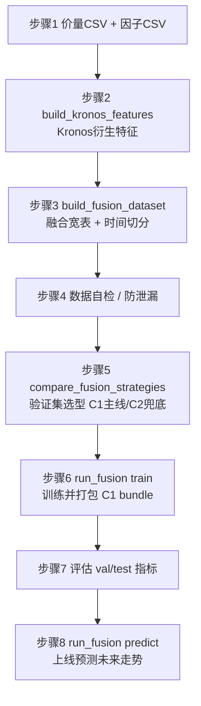

# 方案 C 操作指南：从数据集到训练 / 验证 / 测试 / 上线（逐步执行版）

> 本文是**可照着敲的操作手册**（runbook），把方案 C（外部融合 / C1 主线）的全流程拆成可复制粘贴的命令。
> 设计原理与字段含义见 [方案C_外部融合集成.md](方案C_外部融合集成.md)；本文只讲**怎么一步步做**。
>
> 适用环境：Windows + 仓库根目录 `.venv` 虚拟环境（CPU 即可）。命令中的 Python 一律用 `.\.venv\Scripts\python.exe`。
> **Linux / GPU 服务器**：脚本与参数完全一致，只需替换 shell 写法（激活 venv / 解释器 / 路径）——详见**第 12 节 Windows → Linux 环境切换**。

---

## 0. 全流程总览



| 步骤 | 脚本 | 产物 | 自测命令 |
| --- | --- | --- | --- |
| 1 数据准备 | —（你提供） | 价量 CSV、因子 CSV | — |
| 2 生成 Kronos 特征 | `build_dataC_step2_kronos_features.py`（批量编排）<br/>`build_kronos_features.py`（单标的/底层） | `DataSet/dataC/kronos_features.csv` | `... build_kronos_features.py --smoke` |
| 3 融合 + 切分 | `build_dataC_step3_fusion.py`（dataC 编排）<br/>`build_fusion_dataset.py`（单文件/底层） | `DataSet/dataC/fusion_{all,train,val,test}.csv` | `... build_fusion_dataset.py --smoke` |
| 4 数据自检 | 内联脚本（本文 4 节） | 校验通过 | — |
| 5 选型 | `compare_fusion_strategies.py` | `fusion_selection.json` | `... compare_fusion_strategies.py --smoke` |
| 6 训练打包 | `train_c1_bundle.py`（多标的/主线）<br/>`run_fusion.py train`（单标的） | bundle 目录 | `... train_c1_bundle.py --smoke` |
| 7 评估 | 训练日志 / bundle 的 `manifest.json` | val/test 指标 | — |
| 8 上线预测 | `train_c1_bundle.py --predict`（多标的截面选股/主线）<br/>`run_fusion.py predict`（单标的） | `latest_ranking.json` / `latest_prediction.json` | 同上 smoke |

> **建议先把 6 个 `--smoke` 跑一遍**（见第 10 节），确认环境无误后再上真实数据。

---

## 1. 环境准备

```powershell
# 进入仓库根目录
cd C:\xapproject\Quantia\Kronos

# 激活虚拟环境（PowerShell）
Set-ExecutionPolicy -Scope Process -ExecutionPolicy RemoteSigned
.\.venv\Scripts\Activate.ps1

# 确认依赖（必需 torch；lightgbm 可选，未装自动回退 numpy Ridge）
.\.venv\Scripts\python.exe -c "import torch; print('torch', torch.__version__, 'cuda', torch.cuda.is_available())"
```

- **CPU 即可推理**（实测 `torch 2.x+cpu`）。GPU 仅加速 Kronos 多采样，非必需。
- **Linux 用户**：把上面的 `.\.venv\Scripts\Activate.ps1` / `.\.venv\Scripts\python.exe` 换成 `source .venv/bin/activate` / `.venv/bin/python`，其余命令参数不变（完整对照见第 12 节）。
- **预训练权重**：方案 C 把 Kronos 当纯预测器，需要一份 tokenizer + 主模型。可用官方 `NeoQuasar/Kronos-Tokenizer-base` + `NeoQuasar/Kronos-base`，或你微调后的本地权重目录（下文以 `pretrained/Kronos-Tokenizer-base`、`pretrained/Kronos-base` 占位）。

---

## 2. 步骤 1：从 Quantia cache / DB 自动构建价量 CSV 与因子 CSV（推荐）

从本节开始，方案 C 第 1 步不再要求手工准备 CSV，直接使用脚本：

- `finetune_csv/build_dataC_step1_from_quantia.py`

该脚本会按你的要求完成：

- 从 `C:/xapproject/Quantia/Quantia/quantia/cache/hist` 拉取全量价量（cache 优先）。
- 以最新日期为锚点（可显式指定 `--anchor-date 2026-06-24`）向前回推切分 train/validation/test。
- 输出到 `DataSet/dataC/{train,validation,test}/`，每个 split 含：
    - `price.csv`：`date,symbol,open,high,low,close,volume,amount`
    - `factors.csv`：`date,symbol,<factor...>`
- 生成 `DataSet/dataC/split_report.json` 记录参数、时间边界、行数、标的数。

### 2.1 一条命令构建（按 6/24 向前切分）

```powershell
.\.venv\Scripts\python.exe finetune_csv\build_dataC_step1_from_quantia.py `
        --quantia-root C:/xapproject/Quantia/Quantia `
        --cache-hist-root C:/xapproject/Quantia/Quantia/quantia/cache/hist `
        --out-root C:/xapproject/Quantia/Kronos/DataSet/dataC `
        --anchor-date 2026-06-24 `
        --end-date 2026-06-24 `
        --val-days 180 `
        --test-days 180
```

    脚本默认会读取 `C:/xapproject/Quantia/Quantia/.env` 的 `QUANTIA_DB_*` 配置，并**优先使用远程 DB**。
    当系统环境变量里有本地 DB 配置时，脚本会用项目 `.env` 覆盖当前进程，避免误连本地库。

    可先做连通性验证（不构建数据）：

    ```powershell
    .\.venv\Scripts\python.exe finetune_csv\build_dataC_step1_from_quantia.py `
        --quantia-root C:/xapproject/Quantia/Quantia `
        --check-db
    ```

说明：

- `--anchor-date`：切分锚点（你要求“从最新数据 6 月 24 日往后推”）。
- `--test-days`：测试集回推天数。
- `--val-days`：验证集回推天数。
- 训练集默认取“更早的全部历史”（受 `--start-date` 限制，默认 `2017-01-01`）。

### 2.2 数据来源优先级与缺失处理策略

价量（price.csv）：

1. **优先 cache**：`cache/hist/{prefix}/{symbol}qfq.gzip.pickle`
2. cache 不可用时，**回退 DB**：`cn_stock_spot`（可通过 `--disable-db-fallback-kline` 关闭）

因子（factors.csv）：

1. cache 可直接提供列：`amplitude, quote_change, ups_downs, turnover`
2. 本地可重算技术因子（默认开启）：`local_ret_1d/local_ma_5/...`（来自价量重算，**全历史可用**）
3. DB 财务因子（默认开启，`fin_*`）：`cn_stock_financial`，按披露日 `report_date` 向后 `asof` 对齐到交易日。
   该表**覆盖全历史（约 1988→2026）**，是历史训练区间唯一可靠的 DB 因子来源。
   为避免逐股 4900+ 次串行查询，脚本会**一次性批量预取全市场财务因子**再按标的对齐（极快）。
4. DB 技术指标（默认关闭，`tech_*`）：`cn_stock_indicators`。
   **重要**：远程该表仅覆盖近月（约 `2026-02` 起），**无法覆盖 2017→2025 历史训练区间**，
   因此默认关闭，历史技术因子统一由本地重算（`local_*`）提供。仅当你确需近月 DB 技术指标时，加 `--db-tech` 开启。
5. 消息类缺失兜底：自动补 `news_sent/news_count/event_flag` 并填 0

缺失值规则（不影响后续训练）：

- 先按 `symbol` 做前向填充（防跨标的串值）。
- 消息事件类缺失填 0。
- 其他因子缺失用中位数兜底，再兜底 0。
- 产出的 `price.csv/factors.csv` 默认无 NaN，可直接进入后续 C1 训练流程。

价量清洗（`--sanitize-prices`，**默认开启**）：

- 前复权（qfq）会让少数标的产生**散落的负价 / 负成交额**（实测约 25 只 / 3436 行，分布在序列中段而非早期）。
- 默认会丢弃 `OHLC<=0` 或 `amount<0` 或 `volume<0` 的行，**逐标的**（在本地因子重算前，避免污染 `local_ma/ret`）+ 合并后再兜底一次。
- 零成交量（停牌）合法，予以保留。如需保留原始负价用于排查，加 `--no-sanitize-prices` 关闭。

### 2.3 参数化设计（便于后续接入 Quantia 项目）

常用参数：

- 路径：`--quantia-root`、`--cache-hist-root`、`--out-root`
- 时间：`--start-date`、`--end-date`、`--anchor-date`、`--val-days`、`--test-days`
- 规模：`--max-symbols`（0=全量）
- 数据源开关：
    - `--scan-db-symbols`（额外并入 `cn_stock_spot` 的标的集）
    - `--disable-db-fallback-kline`（禁用价量 DB 回退，仅用 cache）
    - `--disable-db-features`（一键禁用所有 DB 因子，仅 cache+本地重算）
    - `--disable-local-recompute`（禁用本地技术因子重算）
    - `--db-financial` / `--no-db-financial`（DB 财务因子 `fin_*`，**默认开启**，全历史有效）
    - `--db-tech` / `--no-db-tech`（DB 技术指标 `tech_*`，**默认关闭**，远程仅近月）
- 价量清洗：`--sanitize-prices` / `--no-sanitize-prices`（**默认开启**，丢弃负价 / 负额行，见 2.2）
- DB 性能/节流：`--fin-chunk`（财务因子按 code 分块 `IN` 查询的批大小，**默认 400**；远程偶发 `Lost connection during query` 时调小更稳）、`--db-sleep`、`--db-retries`、`--progress-every`
- DB 覆盖与校验：`--prefer-remote-db` / `--no-prefer-remote-db`、`--db-host`、`--db-user`、`--db-password`、`--db-database`、`--db-port`、`--db-charset`、`--check-db`、`--db-check-timeout`（默认 5 秒）
- 自测：`--smoke`（合成数据跑通构建逻辑，不连 DB / cache）

> **参数即布尔开关速记**：`action=BooleanOptionalAction` 的参数（`--db-financial`/`--db-tech`/`--sanitize-prices`/`--prefer-remote-db`）都支持 `--xxx` 开 / `--no-xxx` 关；`store_true` 的（`--scan-db-symbols`/`--disable-*`/`--check-db`/`--smoke`）只有出现即生效。

> **因子覆盖说明**：远程 `cn_stock_indicators`（技术指标）/`cn_stock_spot` 仅覆盖近月，
> 历史训练区间（2017→2025）的技术因子由本地重算 `local_*` 提供；
> `cn_stock_financial`（财务因子 `fin_*`）覆盖全历史，默认参与并按披露日 asof 对齐。

你后续若接入 `C:/xapproject/Quantia/Quantia` 的不同环境，只需改参数，不需要改代码路径。

### 2.4 输出目录结构

```text
DataSet/
    dataC/
        split_report.json
        train/
            price.csv
            factors.csv
        validation/
            price.csv
            factors.csv
        test/
            price.csv
            factors.csv
```

### 2.5 快速自检（建议每次构建后执行）

推荐使用专用校验脚本（检查 schema / NaN / OHLC 一致性 / 行对齐 / 时间切分不重叠 / 因子覆盖）：

```powershell
.\.venv\Scripts\python.exe finetune_csv\examples\validate_dataC.py `
    --data-root C:/xapproject/Quantia/Kronos/DataSet/dataC `
    --expect-anchor 2026-06-24
```

全部通过退出码为 0；存在失败项时退出码为 1 并打印失败清单。

如需极简内联检查，也可：

```powershell
.\.venv\Scripts\python.exe -c "import pandas as pd; \
from pathlib import Path; root=Path('DataSet/dataC'); \
for s in ['train','validation','test']:\
 p=pd.read_csv(root/s/'price.csv', dtype={'symbol':str}); f=pd.read_csv(root/s/'factors.csv', dtype={'symbol':str});\
 print(s,'price',len(p),p['date'].min(),p['date'].max(),'sym',p['symbol'].nunique());\
 print(s,'factor',len(f),f['date'].min(),f['date'].max(),'sym',f['symbol'].nunique())"
```

---

## 3. 步骤 2：用 Kronos 批量生成衍生特征

方案 C 第 2 步把 Kronos 当**纯价量预测器**，对每个交易日用历史窗口多次采样预测，统计出三类衍生特征：

- `k_pred_ret`：预测的 N 步收益率均值（多条采样路径均值）
- `k_up_prob`：上涨概率（多条路径中收益 > 0 的比例）
- `k_pred_vol`：预测不确定性（多条路径末值收益率标准差）

### 3.1 推荐入口：编排脚本（对 dataC 子集批量生成）

由于 Kronos 是**逐窗自回归**推理，CPU 上单次 `predict` 约 0.75s，全市场全历史不可行（20 只全历史 ≈ 11 天）。
因此提供编排脚本 `build_dataC_step2_kronos_features.py`，对 dataC **随机子集 + 最近时间窗**批量生成，并支持**断点续跑**：

```powershell
.\.venv\Scripts\python.exe finetune_csv\build_dataC_step2_kronos_features.py `
    --data-root C:/xapproject/Quantia/Kronos/DataSet/dataC `
    --max-symbols 10 --recent-days 120 `
    --lookback 90 --pred 5 --samples 10 --seed 42
```

- `--max-symbols`：随机抽取的标的数（`--seed` 固定可复现）。
- `--recent-days`：仅为每只标的**最近 N 个交易日**生成特征（控制总耗时）。
- `--lookback`：历史窗口（**≤ 512**，受 `max_context` 限制）。
- `--pred`：预测步数（与后续标签 `horizon` 对齐，常用 5）。
- `--samples`：每窗采样次数（越大越稳但越慢）。
- `--skip-existing` / `--no-skip-existing`（默认开）：复用已生成的 part，**断点续跑**；想强制全量重算用 `--no-skip-existing`。
- `--seed`：随机抽样种子（**仅固定选股**；采样路径仍随机，特征非逐位可复现）。
- `--tokenizer` / `--predictor`：权重来源，默认 `NeoQuasar/Kronos-Tokenizer-base` / `NeoQuasar/Kronos-base`，可换成微调后的本地目录。
- `--out` / `--report`：输出与报告路径，默认 `{data-root}/kronos_features.csv` 与 `{data-root}/kronos_features_report.json`。
- `--max-context`（默认 512）：与 `--lookback` 共同受模型上限约束，**`lookback ≤ max-context ≤ 512`**。
- **产物**：
    - `DataSet/dataC/kronos_features.csv`：`date,symbol,k_pred_ret,k_up_prob,k_pred_vol`
    - `DataSet/dataC/_kronos_parts/{symbol}.csv`：逐只增量产物（中断不丢失，可续跑）
    - `DataSet/dataC/kronos_features_report.json`：参数 / 设备(`device_resolved`) / 选中标的 / 每只耗时 / 行数

> 耗时公式：**标的数 × 窗口数 × samples × 单次耗时**。CPU 单次 ≈ 0.75s；`sample_count` 批量采样无加速优势。
> 每只标的窗口数 ≈ `recent_days + 1`。例：10 只 × 120 天 × samples=10 @CPU ≈ 2.5h。

### 3.2 CPU / GPU 设备选择

脚本通过 `--device` 选择设备，默认 `auto`（**优先 GPU → MPS → CPU** 自动检测）：

```powershell
# CPU（无 GPU 时 auto 即 CPU；也可显式 --device cpu）
.\.venv\Scripts\python.exe finetune_csv\build_dataC_step2_kronos_features.py `
    --data-root .../DataSet/dataC --max-symbols 10 --recent-days 120 --samples 10

# GPU：显存足够时可放大规模（更多标的 / 更长时间窗 / 更高 samples）
.\.venv\Scripts\python.exe finetune_csv\build_dataC_step2_kronos_features.py `
    --device cuda:0 --max-symbols 100 --recent-days 500 --samples 30
```

- `--device auto`：CUDA 可用→`cuda:0`；否则 Apple `mps`；再否则 `cpu`。
- `--device cuda:0`：强制 GPU；若环境无 CUDA 会**自动回退 CPU 并告警**。
- `--device cpu`：强制 CPU，并自动 `set_num_threads` 用满核心。
- 运行时会打印实际设备与按设备外推的预计耗时；`report.json` 记录 `device_resolved`。

> **GPU 提速量级**：通常比 CPU 快 8~25 倍（取决于显卡）。脚本耗时外推内置经验值
> `cpu≈0.75s/次、cuda≈0.05s/次、mps≈0.15s/次`，仅用于估算，真实以实测为准。
>
> **进一步提速（全市场全历史）**：本脚本仍是逐只逐窗串行推理。若要在 GPU 上扩展到全市场全历史，
> 建议改用 `KronosPredictor.predict_batch`（[model/kronos.py](../../model/kronos.py)）做**多标的/多窗一次前向并行**——
> 这是相对 `predict` 的真正提速点（注意 `predict_batch` 要求同批次 `lookback`/`pred_len` 完全一致）。

### 3.3 单标的脚本（底层 / 调试用）

编排脚本内部复用 `build_kronos_features.py` 的 `build_features`。如只想对单只 CSV 调试，可直接：

```powershell
.\.venv\Scripts\python.exe finetune_csv\build_kronos_features.py `
    --price-csv finetune_csv\data\A_000001_daily.csv `
    --tokenizer NeoQuasar/Kronos-Tokenizer-base `
    --predictor NeoQuasar/Kronos-base `
    --out data\kronos_features_000001.csv `
    --symbol 000001 --lookback 90 --pred 5 --samples 30
```

- 输入 CSV 需含 `timestamps + open/high/low/close/volume/amount`。
- 该入口为**单标的、无断点续跑**；批量请用 3.1 的编排脚本。

### 3.4 冒烟自测

```powershell
.\.venv\Scripts\python.exe finetune_csv\build_kronos_features.py --smoke
```

---

## 4. 步骤 3：对齐因子 + 标签 → 融合宽表并按时间切分

step2 的 `kronos_features.csv` 是**多标的**表，其日期窗口通常**横跨 dataC 的 validation 尾部与 test**。
因此推荐用编排脚本 `build_dataC_step3_fusion.py`，它会自动合并 `validation+test` 的 `factors.csv`/`price.csv`、
只保留 kronos 覆盖到的标的、对齐打标签并按时间切分：

### 4.1 推荐入口：dataC 融合编排脚本

```powershell
.\.venv\Scripts\python.exe finetune_csv\build_dataC_step3_fusion.py `
    --data-root C:/xapproject/Quantia/Kronos/DataSet/dataC `
    --horizon 5
```
- `--data-root`（默认 `DataSet/dataC`）：dataC 根目录；`--kronos`（默认 `{data-root}/kronos_features.csv`）；step2 产物路径。
- `--out-dir`（默认 `{data-root}`）：`fusion_*.csv` 与 `fusion_report.json` 的输出目录。- `--sources`（默认 `validation,test`）：从哪些 split 读取因子/价格并纵向合并。
- `--horizon`：未来收益标签天数 H（与 step2 的 `--pred` 对齐，常用 5）。
- `--train-end` / `--val-end`：显式切分边界（不含）。**留空则按唯一交易日 70/15/15 自动分位切分**
  （比例可用 `--train-frac`/`--val-frac` 调）。**生产/全年数据建议显式指定边界**（见第 4.3 节）。
- **产物**（写入 `--data-root`）：
    - `fusion_all.csv` + `fusion_train/val/test.csv`（列结构完全一致）
    - `fusion_report.json`（行数 / 切分边界 / 标签列 / 因子列 / 标的）

> **本次 demo 实跑**：1210 行 kronos → 融合 1200 行（末尾 10 行因 H=5 无未来标签被 dropna），
> 自动切分 `train < 2026-04-22 ≤ val < 2026-05-21 ≤ test` = 831/179/190；44 列、0 NaN、时间无重叠。

- **标签**：`label_fwd_ret_5d = close.shift(-5)/close - 1`，**按 symbol 分组**计算（防跨标的串期）。
- **切分**：按时间先后（禁止随机打乱）；`val`/`test` 不与 `train` 在时间上重叠。
- **因子合并** `how="left"`（以 kronos 行为基准）；dataC 因子表本身 NaN-free，故融合后无缺失。

### 4.2 底层入口：单文件版（调试 / 你自己已拼好三表时）

```powershell
.\.venv\Scripts\python.exe finetune_csv\build_fusion_dataset.py `
    --kronos DataSet\dataC\kronos_features.csv `
    --factors <已合并好的因子CSV> `
    --price <已合并好的价格CSV> `
    --out-dir data `
    --horizon 5 --train-end 2026-04-22 --val-end 2026-05-21
```

> 单文件版**不会**自动合并 val+test，需自行保证 `--factors`/`--price` 覆盖 kronos 的全部日期+未来 H 天；
> 否则越界日期会因缺标签被 dropna。已修复 symbol 以字符串读入（避免 `000001→1`）。冒烟：`... build_fusion_dataset.py --smoke`。

### 4.3 全年数据 / GPU / 生产环境注意事项

当把规模从 demo（10 只 × 120 天）扩到**全年 / 全市场**时，按下面顺序与约束执行：

1. **先重跑 step2 生成全年 kronos 特征（GPU）**——这是耗时大头：
   ```powershell
   .\.venv\Scripts\python.exe finetune_csv\build_dataC_step2_kronos_features.py `
       --device cuda:0 --max-symbols 300 --recent-days 250 --samples 30
   ```
   - `--recent-days 250` ≈ 一个完整交易年；`--samples` 越大特征越稳（生产建议 ≥30）。
   - 断点续跑：`_kronos_parts/` + `--skip-existing` 默认开，中断不丢已完成标的。
   - GPU 提速量级见第 3.2 节；全市场全历史建议改用 `KronosPredictor.predict_batch` 多标的并行。
2. **再跑 step3 融合**——step3 是纯 CPU、向量化的对齐/切分，**对全年数据无需改动**，
   只是 `--sources` 要覆盖 kronos 的日期跨度（横跨更多 split 时写 `validation,test` 或加更多）。
3. **切分边界显式化**：全年数据**不要**依赖自动 70/15/15，应按真实日历显式指定
   `--train-end`/`--val-end`（例如季度/月度边界），保证可复现、与回测口径一致。
4. **防泄漏（生产关键）**：
   - 标签用未来 H 天收益，**最近 H 个交易日没有标签**——这些行只能用于"上线预测"，不可进训练集。
   - 切分严格按时间，`test` 必须晚于 `val` 晚于 `train`；选型只在 `val` 上做（见第 8 节）。
   - 因子的"截止可用时点"要与预测日一致（基本面用 `report_date` 的 as-of 对齐，已在 step1 处理）。
5. **环境兼容性**：
   - GPU 与 CPU 产出的 kronos 特征会因采样随机性**有数值差异**，但分布一致；固定 `--seed` 仅固定选股，
     采样路径仍随机，故**特征不是逐位可复现**——生产中应固定模型版本 + 记录 `fusion_report.json`/`kronos_features_report.json` 以追溯。
   - `--device auto` 在无 GPU 机器上自动回退 CPU，脚本可在生产/CI 中无差别运行。
   - 大规模时注意磁盘：`DataSet/dataC` 已 gitignore（demo 即 4.5GB），生产产物应落在独立数据盘并定期归档。

---

## 5. 步骤 4：数据自检与防泄漏检查（关键）

> step3 的编排脚本已内置了多项检查（NaN / 时间不重叠 / `k_up_prob` 越界）；本节是**独立复核**，可随时重跑。
> 下面脚本不写死因子名，而是把除 `date/symbol/label` 之外的**所有列**视为特征检查，适配 dataC 的 `local_*/fin_*/k_*` 列。

```python
import pandas as pd
root = "DataSet/dataC"          # build_dataC_step3_fusion.py 的输出目录（单文件版则为 data）
label = "label_fwd_ret_5d"      # 与 --horizon 对齐
meta = {"date", "symbol", label}
prev_max = None
for split in ["train", "val", "test"]:
    df = pd.read_csv(f"{root}/fusion_{split}.csv", parse_dates=["date"], dtype={"symbol": str})
    feat = [c for c in df.columns if c not in meta]   # 其余全部视为特征
    assert {"date", label}.issubset(df.columns), f"{split} 缺列"
    assert not df[feat].isnull().any().any(), f"{split} 特征有 NaN"
    assert df[label].notnull().all(), f"{split} 标签有 NaN"
    assert df["k_up_prob"].between(0, 1).all(), f"{split} k_up_prob 越界"
    lo, hi = df.date.min(), df.date.max()
    if prev_max is not None:
        assert lo > prev_max, f"{split} 与上一段时间重叠（泄漏）"
    prev_max = hi
    print(split, len(df), "特征列", len(feat), "日期", lo.date(), "~", hi.date())
print("数据自检通过")
```

防泄漏 checklist：
- [ ] 标签用**样本日之后**的价格（`shift(-5)`），特征只用当日及之前信息。
- [ ] train / val / test **按时间不重叠**。
- [ ] 季度因子前向填充，不得把「披露日之后才知道」的值回填到披露前。
- [ ] **选型只在验证集做，测试集仅最终评估**（见步骤 5/7）。

---

## 6. 步骤 5：C1 vs C2 选型（验证集选型，C1 主线 / C2 兜底）

`compare_fusion_strategies.py` 直接消费 step3 产出的 `fusion_{train,val,test}.csv`（多标的兼容）：

```powershell
.\.venv\Scripts\python.exe finetune_csv\compare_fusion_strategies.py `
    --train DataSet\dataC\fusion_train.csv --val DataSet\dataC\fusion_val.csv --test DataSet\dataC\fusion_test.csv `
    --kronos-cols k_pred_ret,k_up_prob,k_pred_vol `
    --factor-cols amplitude,quote_change,ups_downs,turnover,local_ret_1d,local_ret_5d,local_ma_5,local_ma_10,local_ma_20,local_vol_ma_5,local_amt_ma_5,local_hl_spread,local_oc_change,fin_eps,fin_bps,fin_roe,fin_roa `
    --label label_fwd_ret_5d `
    --switch-threshold 0.005 `
    --out-json DataSet\dataC\fusion_selection.json
```

- `--kronos-cols` / `--factor-cols`：参与融合的 Kronos 特征列 / 外部因子列（逗号分隔，必须是 `fusion_*.csv` 中真实存在的列名）。
  上例仅列举部分 dataC 因子；可把 22 个 `fin_*` + 9 个 `local_*` + 4 个 cache 因子全部填入。
- `--label`（默认 `label_fwd_ret_5d`）：与 step3 的 `--horizon` 对齐。
- 同时跑 **C1 特征融合**、**C2 加权**、**C2 stacking**；在 train 训基模型、**val 调组合器并选型**、test 仅评估。
- **以 C1 为主线**：默认选 C1；仅当某 C2 方案**验证集 IC ≥ C1 + `--switch-threshold`（默认 0.005）** 时才**兜底切换**。
- 输出 val/test 两张指标表 + 生产策略 + 切换理由；`--out-json` 落盘供流水线读取。
- 终端末尾会显示 `==> 生产策略: C1_特征融合（主线；...）` 或兜底切换说明。

> 该步是**离线选型 / 复核**，结论指导你是否照常用 C1 主线（下一步）。

---

## 7. 步骤 6：训练并打包可部署的 C1 模型 bundle

> **重要区分（避免踩坑）**：`run_fusion.py train` 是**单标的、端到端**入口——它从一份 `--price-csv` + `--factors`
> **自己重新生成 Kronos 特征**再训练打包，**不会**消费 step3 产出的多标的 `fusion_*.csv`。
> 因此本指南给两条路：
> - **A. 多标的 dataC（本指南主线）**：用 `train_c1_bundle.py` 直接吃 step3 的多标的 `fusion_*.csv` 训练并打包
>   可部署 bundle（见 7.1）。
> - **B. 单标的快速打包/上线**：用 `run_fusion.py train`（自带特征生成 → 融合 → 训练 → bundle，见 7.2）。

### 7.1 多标的 C1 bundle 训练（本指南主线，推荐）

`train_c1_bundle.py` 消费 step3 产出的 `fusion_{train,val,test}.csv`，训练 C1 下游模型并打包成
**与 `run_fusion.py` 完全一致的 bundle**（`manifest.json` + `c1_lgb.txt`/`c1_ridge.npz`），可被服务侧
`C1Model.load` 直接加载：

```powershell
.\.venv\Scripts\python.exe finetune_csv\train_c1_bundle.py `
    --data-root C:/xapproject/Quantia/Kronos/DataSet/dataC `
    --out-bundle runs\dataC_c1 --horizon 5
```

- `--data-root`：自动找 `fusion_{train,val,test}.csv`；也可用 `--train/--val/--test` 显式指定三份文件。
- `--horizon`（或 `--label`）：标签列，与 step3 对齐（给 `--horizon 5` 即用 `label_fwd_ret_5d`）。
- `--backend auto|lightgbm|ridge`（默认 auto，LightGBM 优先）；`--kronos-cols` 默认 `k_pred_ret,k_up_prob,k_pred_vol`。
- 特征列**自动识别**：除 `date/symbol/label` 外全部为特征（kronos 列排前），无需手列因子名。
- **评估口径**：池化 `IC/RankIC/RMSE/Hit` + **按交易日截面再平均**的 `IC_by_date/RankIC_by_date`（多标的更合理）。
- **产物 bundle** `runs/dataC_c1/`：`manifest.json`（含 `multi_symbol/n_symbols/symbols/feat_cols/metrics`）+ `c1_lgb.txt` 或 `c1_ridge.npz`。
- 冒烟：`... train_c1_bundle.py --smoke`（合成多标的数据跑通 train→save→load）。

> **demo 实跑**：10 只 × 41 特征，train/val/test=831/179/190，val IC=-0.070、test IC=-0.131
> （**负 IC 是极小数据的过拟合伪象**，与 step5 的 C1 完全一致；生产需用全市场/全年数据复核）。

### 7.2 单标的端到端打包（备选）

```powershell
.\.venv\Scripts\python.exe finetune_csv\run_fusion.py train `
    --price-csv finetune_csv\data\A_000001_daily.csv `
    --factors data\factors_000001.csv `
    --tokenizer pretrained\Kronos-Tokenizer-base `
    --predictor pretrained\Kronos-base `
    --out-bundle runs\fusion_000001 `
    --symbol 000001 --lookback 90 --pred 5 --samples 30 --horizon 5 `
    --train-end 2024-01-01 --val-end 2025-01-01
```

- 一条命令内部自动串联：生成 Kronos 特征 → 融合 + 切分 → 训练 C1（LightGBM 优先，未装回退 Ridge）→ 打包。
- `--backend auto|lightgbm|ridge`（默认 auto）。
- **产物 bundle 目录** `runs/fusion_000001/`：

| 文件 | 说明 |
| --- | --- |
| `manifest.json` | 后端、特征列顺序、`lookback/pred/samples/horizon`、tokenizer/主模型路径、**val/test 指标** |
| `c1_lgb.txt` 或 `c1_ridge.npz` | C1 下游模型权重 |

---

## 8. 步骤 7：查看验证 / 测试评估

训练命令结束会直接打印切分规模与指标，例如：

```
[train] 后端=ridge  切分 train/val/test=(980, 240, 120)
  val: RMSE=0.0210  IC=0.0473  RankIC=0.0455  Hit=0.531
  test: RMSE=0.0218  IC=0.0391  RankIC=0.0372  Hit=0.522
```

也可随时查 bundle 里的指标：

```powershell
.\.venv\Scripts\python.exe -c "import json;print(json.dumps(json.load(open(r'runs/fusion_000001/manifest.json',encoding='utf-8'))['metrics'],ensure_ascii=False,indent=2))"
```

评估口径：
- **回归**：RMSE / IC（信息系数）/ RankIC。
- **方向**：Hit（方向命中率）。
- **进阶回测**：用测试集预测做组合回测（年化 / 夏普 / 最大回撤），对比「仅 Kronos」「仅因子」「融合」三组验证增益。

> **以验证集挑参数 / 选方案，测试集只看一次**，避免选择泄漏。

---

## 9. 步骤 8：上线预测未来走势

> **两条上线路径**，与步骤 6 的两种 bundle 一一对应：
> - **A. 多标的截面打分（本指南主线）**：`train_c1_bundle.py --predict` 吃**已算好的特征宽表**，
>   对某交易日全市场横截面打分排序 → 选股清单（见 9.1）。
> - **B. 单标的端到端**：`run_fusion.py predict` 从一份 price-csv **现算 Kronos 特征**再打分（见 9.2）。
>
> 二者 bundle **不可混用**：多标的 bundle 的 `manifest.json` 无 `lookback/symbol` 字段、特征列含全部因子，
> 只能走 9.1；单标的 bundle 记录了 `lookback/pred/samples`，只能走 9.2。

### 9.1 多标的截面打分（主线，配合 `train_c1_bundle.py` 的 bundle）

```powershell
.\.venv\Scripts\python.exe finetune_csv\train_c1_bundle.py --predict `
    --data-root C:/xapproject/Quantia/Kronos/DataSet/dataC `
    --out-bundle runs\dataC_c1 `
    --top 10 `
    --out-json runs\dataC_c1\latest_ranking.json
```

- `--predict`：切到打分模式（不训练），从 `--out-bundle` 加载 `manifest.json` + 模型。
- `--features`（默认 `{data-root}/fusion_all.csv`）：打分用的特征宽表，列必须包含 bundle 的 `feat_cols`。
- `--as-of`（默认取宽表中最新一天）：指定打分交易日 `YYYY-MM-DD`。
- `--top`（默认 10）：多空候选各取前 N 只。
- `--out-json`：排序结果落盘。
- 输出（按预测未来 H 日收益排序的选股清单）：

```json
{
  "as_of_date": "2026-06-16", "horizon_days": 5, "backend": "lightgbm",
  "multi_symbol": true, "n_symbols": 10,
  "long_candidates": [
    {"rank": 1, "symbol": "601619", "pred_fwd_ret": 0.0890, "direction": "up",
     "k_up_prob": 1.0, "k_pred_vol": 0.02, "realized_fwd_ret": -0.1014}
  ],
  "short_candidates": [ ... ]
}
```

- `long_candidates`/`short_candidates`：预测最强 / 最弱的标的（做多 / 规避候选）。
- `realized_fwd_ret`：仅当截面带标签时给出（回看校验用；真正上线的"最新预测日"无标签）。
- **真正上线时**：用最新一根 K 线（最近 H 天**无标签**）现算特征拼成同结构宽表喂 `--features`；
  demo 里用的是 `fusion_all.csv` 的最新一天（带标签，仅作流程演示）。

> **本次 demo 实跑**（`--top 5`）：`as_of=2026-06-16`，10 只截面打分，预测方向与实际**普遍相反**
> （预测 up 多数实际 down）——这是 831 行极小数据**过拟合 + 截面太窄**的必然结果，
> **不是模型缺陷**，换全市场/全年数据并参考第 14 节优化后即改善。

### 9.2 单标的端到端预测（配合 `run_fusion.py train` 的 bundle）

```powershell
.\.venv\Scripts\python.exe finetune_csv\run_fusion.py predict `
    --bundle runs\fusion_000001 `
    --price-csv finetune_csv\data\A_000001_daily.csv `
    --factors data\factors_000001.csv `
    --out-json runs\fusion_000001\latest_prediction.json
```

- 只需历史价量（**≥ lookback 根**）+ 当日可得因子；脚本自动**外推未来时间戳**（频率无关），对最新窗口多次采样 → C1 打分。
- 若 bundle 未记录权重路径，可用 `--tokenizer`/`--predictor` 覆盖；`--device` 选推理设备（见第 13 节）。
- 输出（对未来 `horizon` 日收益的方向与幅度）：

```json
{
  "as_of_date": "2025-06-20", "symbol": "000001", "horizon_days": 5,
  "pred_fwd_ret": 0.0123, "direction": "up",
  "k_up_prob": 0.62, "k_pred_vol": 0.018, "backend": "ridge"
}
```

- `pred_fwd_ret`：预测未来 H 日收益；`direction`：方向；`k_up_prob/k_pred_vol`：Kronos 给的上涨概率与不确定性，可作风控参考。

部署形态：
- **离线批量**：收盘后用任务计划跑一次 `predict`，结果落库 / 推下游。
- **常驻服务**：把 `load_bundle` + `predict_latest`（或 9.1 的 `predict_bundle`）包成 Flask/FastAPI（参考 `webui/`），**进程启动时加载一次权重**，请求只跑推理。
- **更新节奏**：价量每日增量重算特征；C1 模型按月 / 季滚动 `train` 重训覆盖 bundle，并用步骤 5 定期复核 C1 是否仍优于 C2 兜底。

---

## 10. 先跑通：6 个冒烟自测（强烈建议）

任何一步上真实数据前，先确认管线本身没问题（**无需权重 / 外部文件**）：

```powershell
.\.venv\Scripts\python.exe finetune_csv\build_dataC_step1_from_quantia.py --smoke
.\.venv\Scripts\python.exe finetune_csv\build_kronos_features.py --smoke
.\.venv\Scripts\python.exe finetune_csv\build_fusion_dataset.py --smoke
.\.venv\Scripts\python.exe finetune_csv\compare_fusion_strategies.py --smoke
.\.venv\Scripts\python.exe finetune_csv\train_c1_bundle.py --smoke
.\.venv\Scripts\python.exe finetune_csv\run_fusion.py smoke
```

全部出现「通过」字样即环境就绪。`run_fusion.py smoke` 会完整跑 train→save→load→predict 并打印一条示例预测。
（注：`build_dataC_step2_kronos_features.py` / `build_dataC_step3_fusion.py` 为编排脚本，其核心逻辑分别由
`build_kronos_features.py --smoke` 与 `build_fusion_dataset.py --smoke` 覆盖，无需重复 smoke。）

---

## 11. GPU 服务器迁移：前置条件与环境准备

> 本机 CPU 足以跑通全流程与小规模 demo；当需要**全市场 / 全年**特征时（步骤 2 是唯一耗时大头），
> 把 step2 搬到 GPU 服务器。其余步骤（3~8）仍是纯 CPU、向量化，**无需改动**。

### 11.1 前置条件（硬件 / 驱动）

- **NVIDIA GPU + 驱动**：`nvidia-smi` 能正常输出；记下 CUDA 驱动版本。
- **显存**：Kronos-base/small 权重很小（数百 MB 级），单卡 8GB 足够；显存越大可放大 `predict_batch` 批量。
- **磁盘**：全市场全年 kronos 特征 + 中间产物可达数十 GB，预留独立数据盘。

### 11.2 环境准备（在 GPU 服务器上，逐条执行）

```bash
# 1) 取代码（与本机同一仓库）
git clone https://github.com/posbright/Kronos.git && cd Kronos

# 2) 建独立虚拟环境（不要直接拷本机 .venv，CPU 版 torch 不能用 GPU）
python -m venv .venv && source .venv/bin/activate   # Windows: .\.venv\Scripts\Activate.ps1

# 3) 装 CUDA 版 PyTorch（按服务器 CUDA 版本选 index-url，cu121 示例）
pip install torch --index-url https://download.pytorch.org/whl/cu121

# 4) 装其余依赖
pip install -r requirements.txt

# 5) 验证 GPU 可见
python -c "import torch; print('cuda', torch.cuda.is_available(), torch.cuda.get_device_name(0))"
```

> **关键坑**：本机 `.venv` 里是 `torch x.x+cpu`，**直接复制到 GPU 机器仍只会用 CPU**。
> 必须在 GPU 机器上重建环境并装 **CUDA 版 torch**（第 3 步），用第 5 步确认 `cuda True`。

### 11.3 数据与权重迁移

- **预训练权重**：首次 `from_pretrained("NeoQuasar/...")` 会自动下载到 HuggingFace 缓存；
  离线机可把本机 `~/.cache/huggingface/`（Windows `%USERPROFILE%\.cache\huggingface`）整体拷过去，或用本地微调权重目录（`--tokenizer/--predictor` 指向）。
- **数据**：`DataSet/dataC` 已 gitignore，**不会随 git 同步**。两种选择：
  1. **重建（推荐）**：在 GPU 机上重跑步骤 1（`build_dataC_step1_from_quantia.py`）——需该机能连 Quantia DB / cache。
  2. **拷贝**：把本机 `DataSet/dataC/{train,validation,test}` 打包传到 GPU 机相同相对路径。
- **DB 连通性**：若走重建路线，确认 GPU 机能访问 `QUANTIA_DB_*`（先 `--check-db` 验证，见 2.1）。

### 11.4 在 GPU 上运行 step2（放大规模）

```bash
python finetune_csv/build_dataC_step2_kronos_features.py \
    --device cuda:0 --max-symbols 300 --recent-days 250 --samples 30 --skip-existing
```

- `--device cuda:0`：显式 GPU；无 CUDA 会自动回退 CPU 并告警（见 3.2）。
- 断点续跑默认开（`_kronos_parts/` + `--skip-existing`），中断不丢已完成标的。
- 全市场全历史建议改用 `KronosPredictor.predict_batch` 多标的并行（见 3.2 末尾）。
- 跑完把 `DataSet/dataC/kronos_features.csv` 带回（或就地继续步骤 3~8）。

---

## 12. Windows → Linux 环境切换（命令对照与详细步骤）

> 本文正文命令默认 **Windows + PowerShell**。切到 **Linux（Ubuntu/CentOS 等，含 GPU 服务器）** 时，
> **脚本与参数完全不变**，只需替换"激活 venv / Python 解释器 / 路径与换行符"等 shell 层面写法。
> 本节给出一一对照与可直接照抄的 Linux 命令。

### 12.1 Windows ↔ Linux 写法对照

| 用途 | Windows（PowerShell） | Linux（bash） |
| --- | --- | --- |
| 激活虚拟环境 | `.\.venv\Scripts\Activate.ps1` | `source .venv/bin/activate` |
| 直接调 venv 解释器 | `.\.venv\Scripts\python.exe` | `.venv/bin/python`（或激活后直接 `python`） |
| 命令换行符 | 反引号 `` ` `` | 反斜杠 `\` |
| 路径分隔符 | `\` 或 `/` 均可 | 一律 `/` |
| 仓库根 | `C:\xapproject\Quantia\Kronos` | 例如 `/home/user/Kronos` |
| Quantia 项目根 | `C:/xapproject/Quantia/Quantia` | 例如 `/home/user/Quantia` |
| 环境变量引用 | `$env:VAR` | `$VAR` |
| HF 缓存目录 | `%USERPROFILE%\.cache\huggingface` | `~/.cache/huggingface` |
| 设执行策略 | `Set-ExecutionPolicy -Scope Process RemoteSigned` | 无需（bash 无此概念） |

> **要点**：所有 `finetune_csv/*.py` 的**参数名、默认值、行为在两个平台完全一致**——
> 文档里凡是 `.\.venv\Scripts\python.exe finetune_csv\xxx.py` 的命令，Linux 上写成
> `.venv/bin/python finetune_csv/xxx.py` 即可，参数原样照搬。

### 12.2 Linux 首次环境准备（逐条执行）

```bash
# 1) 取代码
git clone https://github.com/posbright/Kronos.git
cd Kronos

# 2) 建虚拟环境（不要从 Windows 拷 .venv，二进制不兼容）
python3 -m venv .venv
source .venv/bin/activate

# 3) 安装 PyTorch
#    CPU 机：
pip install torch --index-url https://download.pytorch.org/whl/cpu
#    GPU 机（按 CUDA 版本换 index-url，cu121 示例）：
# pip install torch --index-url https://download.pytorch.org/whl/cu121

# 4) 其余依赖
pip install -r requirements.txt

# 5) 验证（CPU 机 cuda 显示 False 属正常）
python -c "import torch; print('torch', torch.__version__, 'cuda', torch.cuda.is_available())"
```

> **不要直接复制 Windows 的 `.venv`**：venv 内是平台相关的二进制（解释器软链、`*.pyd`/`*.so`、
> `torch` whl），跨平台拷贝必坏。务必在 Linux 上重新 `python3 -m venv` 并重装依赖。

### 12.3 数据 / 权重 / 路径迁移

- **代码**：随 git 同步，无需额外处理。
- **数据 `DataSet/dataC`**：已 gitignore，**不随 git 走**。两种方式（同第 11.3 节）：
  - 重建：Linux 上重跑步骤 1（需能连 Quantia DB / cache）。
  - 拷贝：`scp`/`rsync` 传到 Linux 相同相对路径，例如
    ```bash
    rsync -avz user@winhost:/c/xapproject/Quantia/Kronos/DataSet/dataC/ ./DataSet/dataC/
    ```
- **预训练权重**：首次 `from_pretrained` 自动下载到 `~/.cache/huggingface`；离线机把 Windows 的
  `%USERPROFILE%\.cache\huggingface` 拷到 Linux `~/.cache/huggingface`，或用本地权重目录传 `--tokenizer/--predictor`。
- **硬编码路径**：步骤 1 的 `--quantia-root`/`--cache-hist-root` 默认值是 Windows 路径，Linux 上**显式传 Linux 路径**：
  ```bash
  .venv/bin/python finetune_csv/build_dataC_step1_from_quantia.py \
      --quantia-root /home/user/Quantia \
      --cache-hist-root /home/user/Quantia/quantia/cache/hist \
      --out-root /home/user/Kronos/DataSet/dataC \
      --anchor-date 2026-06-24 --val-days 180 --test-days 180
  ```
- **Quantia `.env`**：脚本默认读 `{quantia-root}/.env` 的 `QUANTIA_DB_*`，确认该文件在 Linux 上存在且可读；
  先 `--check-db` 验证连通（见 2.1）。

### 12.4 Linux 上跑全流程（命令直接照抄）

```bash
source .venv/bin/activate

# 步骤2：GPU 生成 Kronos 特征（CPU 机去掉 --device 或用 --device cpu）
.venv/bin/python finetune_csv/build_dataC_step2_kronos_features.py \
    --data-root ./DataSet/dataC --device cuda:0 \
    --max-symbols 300 --recent-days 250 --samples 30 --skip-existing

# 步骤3：融合 + 切分
.venv/bin/python finetune_csv/build_dataC_step3_fusion.py \
    --data-root ./DataSet/dataC --horizon 5

# 步骤5：选型
.venv/bin/python finetune_csv/compare_fusion_strategies.py \
    --train DataSet/dataC/fusion_train.csv --val DataSet/dataC/fusion_val.csv \
    --test DataSet/dataC/fusion_test.csv --label label_fwd_ret_5d \
    --out-json DataSet/dataC/fusion_selection.json

# 步骤6：训练多标的 C1 bundle
.venv/bin/python finetune_csv/train_c1_bundle.py \
    --data-root ./DataSet/dataC --out-bundle runs/dataC_c1 --horizon 5

# 步骤8：上线截面打分
.venv/bin/python finetune_csv/train_c1_bundle.py --predict \
    --data-root ./DataSet/dataC --out-bundle runs/dataC_c1 \
    --top 10 --out-json runs/dataC_c1/latest_ranking.json
```

### 12.5 Linux 常见坑

- **换行符（CRLF→LF）**：从 Windows 带过来的 CSV/脚本可能是 CRLF；Python 读 CSV 不受影响，
  但 shell 脚本（`.sh`）若为 CRLF 会报 `bad interpreter`，用 `dos2unix file.sh` 或 `sed -i 's/\r$//' file.sh` 修。
- **shell 脚本可执行权限**：`chmod +x webui/start.sh` 后再 `./start.sh`。
- **大小写敏感**：Linux 文件名/路径**区分大小写**（`DataSet` ≠ `dataset`），照抄仓库原名。
- **`python` vs `python3`**：多数发行版裸 `python` 不存在，建系统层用 `python3`；激活 venv 后 `python` 即指向 venv。
- **GPU 不可见**：`nvidia-smi` 正常但 `torch.cuda.is_available()` 为 False → 多半装了 CPU 版 torch，
  按 12.2 第 3 步重装 CUDA 版（见第 13 节关于设备无关性的说明）。
- **后台常驻**：长任务用 `nohup ... &`、`tmux`/`screen` 或 `systemd` 守护，避免断连中断（step2 自带断点续跑可续）。

---

## 13. GPU 训练 / CPU 推理：可行性与最佳实践

> **结论先行：完全可行，且推荐"GPU 离线、CPU 上线"。** 训练阶段的 GPU 只加速 step2 的 Kronos 采样；
> 下游 C1 模型与上线打分本就在 CPU 上跑。

**为什么 CPU 推理没问题：**

- **C1 bundle 是纯 CPU 产物**：`c1_lgb.txt`（LightGBM）/ `c1_ridge.npz`（numpy）与设备无关，
  加载即在 CPU 上 `predict`，毫秒级，**不依赖 GPU**。
- **Kronos 权重设备无关**：`state_dict` 同一份，`KronosPredictor(..., device="cpu")` 与 `cuda:0` 加载的是同一组权重，
  数值上一致（差异只来自**采样随机性**，与设备无关）。
- **两条上线路径的算力需求不同**：
  - **9.1 多标的截面打分**：吃**预先算好的特征宽表**，上线时**根本不调用 Kronos**，只是一次 LightGBM 截面 `predict` → 纯 CPU、亚毫秒，最适合常驻服务。
  - **9.2 单标的端到端**：上线时要现算 Kronos 特征（每样本 CPU ≈ 0.75s）→ 日频 / 低频单标的 **CPU 足够**；
    若要对**很多标的**实时打分，应把"算特征"放到 GPU 离线批处理，上线只走 9.1。

**推荐生产形态（GPU 离线 + CPU 上线）：**

| 阶段 | 设备 | 频率 | 内容 |
| --- | --- | --- | --- |
| 特征生成（step2） | **GPU** | 每日收盘后批量 | 全市场最新窗口 Kronos 特征，落特征宽表 |
| 模型重训（step6） | CPU/GPU 均可 | 按月 / 季 | `train_c1_bundle.py` 重训覆盖 bundle |
| 上线打分（step8） | **CPU** | 实时 / 盘后 | 9.1 加载 bundle 对最新截面 `predict` 选股 |

> **最佳实践**：上线机只需 **CPU 版 torch + lightgbm + bundle + 当日特征宽表**，无需 GPU。
> 把 step2 的"重算"与 step8 的"打分"解耦——GPU 算特征落盘，CPU 服务读盘打分——既省成本又稳。

---

## 14. 效果不理想时的优化空间（提升预测准确性）

> demo（10 只 × 120 天）的负 IC **不代表方案本身无效**，而是**数据太小 + 截面太窄**导致严重过拟合。
> 下面按"杠杆从大到小"排列优化方向。

1. **扩大数据规模（最大杠杆）**：从 10 只 × 120 天扩到**全市场 × 多年**。
   样本量上去后，41 维特征不再过拟合，截面 IC 才有统计意义（先做第 11、13 节的 GPU 迁移）。
2. **提升 Kronos 特征质量**：`--samples` 调大（生产 ≥30，越大方向概率越稳）、`--lookback` 调优（≤512）、
   用 `predict_batch` 在 GPU 上负担更大规模与更高采样。
3. **因子工程（截面类任务最关键）**：
   - **截面标准化**：每个交易日内对因子做 z-score / 去极值（winsorize），消除跨日量纲漂移。
   - **中性化**：对行业、市值做回归取残差，避免模型只学到风格暴露。
   - **因子筛选**：算单因子 IC / IC 衰减、去冗余（相关性 > 0.8 的留一个），剔除无效因子（见 FAQ"IC 为负"）。
4. **标签工程**：`--horizon` 对齐你的交易周期；用**超额收益**（减基准 / 行业均值）做标签，
   让模型学截面相对强弱而非大盘 beta；必要时改用分位 / 排序标签。
5. **模型调参与正则**：LightGBM 调 `num_leaves / learning_rate / min_child_samples / feature_fraction`、
   加 `early_stopping`（用 val 集）、`lambda_l1/l2` 正则；样本/特征比偏小时降低模型复杂度。
6. **选型与集成**：用步骤 5 定期对照 **C1 vs C2**；可对**多 horizon / 多随机种子**的预测做集成（stacking / 平均）降方差。
7. **评估口径**：以**按交易日截面 IC**（`IC_by_date`，见 7.1）而非池化 IC 为准；
   最终用**回测**（年化 / 夏普 / 最大回撤 / 分组多空）验证增益，而不仅看 IC。
8. **防过拟合纪律**：滚动重训 + 样本外稳定性检查；特征数远小于样本数；选型只在 val、test 只看一次（第 5 节）。

> **一句话**：demo 的目标是"跑通流程"；要"预测准"，**先加数据规模 + 截面标准化/中性化 + 调参**，再谈精调。

---

## 15. 常见问题 / 排错

| 现象 | 原因 | 处理 |
| --- | --- | --- |
| `price 表缺少列` | 价量 CSV 缺 OHLCV/amount | 补齐 `timestamps,open,high,low,close,volume,amount`（amount 可填 0） |
| 训练集为空 | `--train-end` 早于全部数据 | 调整切分日期使各段非空 |
| 预测报「历史不足」 | 价量行数 < `lookback` | 提供更长历史或调小 `--lookback` |
| 速度很慢 | `--samples` 太大 / CPU 推理 | 调小 samples、用 GPU、或 `predict_batch` 批量 |
| 后端显示 `ridge` | 未装 lightgbm | 正常，功能不缺失；要 LightGBM 可 `pip install lightgbm`（仓库用原生 API，**无需 scikit-learn**） |
| IC 很低甚至为负 | 因子无效 / 标签 horizon 不匹配 | 复核因子有效性、对齐 `--pred` 与 `--horizon`、用步骤 5 对照 |
| 怀疑泄漏 | 选型用了 test / 因子用了未来值 | 回到第 5 节 checklist 逐条核对 |

---

## 12. 一键串联（最小示例）

确认 smoke 通过、数据就绪后，真实流程其实就两条命令（选型可选）：

```powershell
# 训练打包（内部已含特征生成 + 融合切分）
.\.venv\Scripts\python.exe finetune_csv\run_fusion.py train `
    --price-csv <价量csv> --factors <因子csv> `
    --tokenizer <tokenizer目录> --predictor <主模型目录> `
    --out-bundle runs\fusion_<symbol> --symbol <symbol> `
    --lookback 90 --pred 5 --samples 30 --horizon 5 `
    --train-end 2024-01-01 --val-end 2025-01-01

# 上线预测
.\.venv\Scripts\python.exe finetune_csv\run_fusion.py predict `
    --bundle runs\fusion_<symbol> --price-csv <最新价量csv> --factors <因子csv> `
    --out-json runs\fusion_<symbol>\latest_prediction.json
```

> 想分阶段细粒度控制 / 复核选型，则按第 3→9 节逐步执行；`run_fusion.py` 把它们封装成了生产主线。

---

### 关联文档
- 设计原理：[方案C_外部融合集成.md](方案C_外部融合集成.md)
- A 股微调总览：[A股微调操作指南.md](A%E8%82%A1%E5%BE%AE%E8%B0%83%E6%93%8D%E4%BD%9C%E6%8C%87%E5%8D%97.md)
- Quantia 统一流水线（方案 B 工作台）：[../07_Quantia全流程操作指南.md](../07_Quantia%E5%85%A8%E6%B5%81%E7%A8%8B%E6%93%8D%E4%BD%9C%E6%8C%87%E5%8D%97.md)
