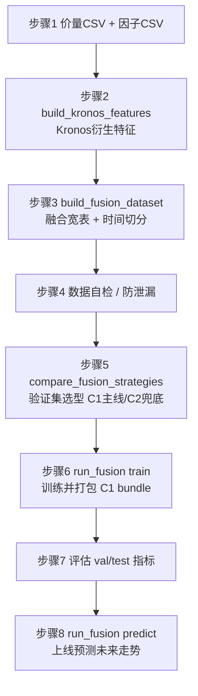

# 方案 C 操作指南：从数据集到训练 / 验证 / 测试 / 上线（逐步执行版）

> 本文是**可照着敲的操作手册**（runbook），把方案 C（外部融合 / C1 主线）的全流程拆成可复制粘贴的命令。
> 设计原理与字段含义见 [方案C_外部融合集成.md](方案C_外部融合集成.md)；本文只讲**怎么一步步做**。
>
> 适用环境：Windows + 仓库根目录 `.venv` 虚拟环境（CPU 即可）。命令中的 Python 一律用 `.\.venv\Scripts\python.exe`。

---

## 0. 全流程总览



| 步骤 | 脚本 | 产物 | 自测命令 |
| --- | --- | --- | --- |
| 1 数据准备 | —（你提供） | 价量 CSV、因子 CSV | — |
| 2 生成 Kronos 特征 | `build_dataC_step2_kronos_features.py`（批量编排）<br/>`build_kronos_features.py`（单标的/底层） | `DataSet/dataC/kronos_features.csv` | `... build_kronos_features.py --smoke` |
| 3 融合 + 切分 | `build_fusion_dataset.py` | `fusion_{all,train,val,test}.csv` | `... build_fusion_dataset.py --smoke` |
| 4 数据自检 | 内联脚本（本文 4 节） | 校验通过 | — |
| 5 选型 | `compare_fusion_strategies.py` | `fusion_selection.json` | `... compare_fusion_strategies.py --smoke` |
| 6 训练打包 | `run_fusion.py train` | bundle 目录 | `... run_fusion.py smoke` |
| 7 评估 | 训练日志 / bundle 的 `manifest.json` | val/test 指标 | — |
| 8 上线预测 | `run_fusion.py predict` | `latest_prediction.json` | 同上 smoke |

> **建议先把 5 个 `--smoke` 跑一遍**（见第 9 节），确认环境无误后再上真实数据。

---

## 1. 环境准备

```powershell
# 进入仓库根目录
cd C:\xapproject\Quantia\Kronos

# 激活虚拟环境（PowerShell）
Set-ExecutionPolicy -Scope Process -ExecutionPolicy RemoteSigned
.\.venv\Scripts\Activate.ps1

# 确认依赖（必需 torch；lightgbm 可选，未装自动回退 numpy Ridge）
.\.venv\Scripts\python.exe -c "import torch; print('torch', torch.__version__, 'cuda', torch.cuda.is_available())"
```

- **CPU 即可推理**（实测 `torch 2.x+cpu`）。GPU 仅加速 Kronos 多采样，非必需。
- **预训练权重**：方案 C 把 Kronos 当纯预测器，需要一份 tokenizer + 主模型。可用官方 `NeoQuasar/Kronos-Tokenizer-base` + `NeoQuasar/Kronos-base`，或你微调后的本地权重目录（下文以 `pretrained/Kronos-Tokenizer-base`、`pretrained/Kronos-base` 占位）。

---

## 2. 步骤 1：从 Quantia cache / DB 自动构建价量 CSV 与因子 CSV（推荐）

从本节开始，方案 C 第 1 步不再要求手工准备 CSV，直接使用脚本：

- `finetune_csv/build_dataC_step1_from_quantia.py`

该脚本会按你的要求完成：

- 从 `C:/xapproject/Quantia/Quantia/quantia/cache/hist` 拉取全量价量（cache 优先）。
- 以最新日期为锚点（可显式指定 `--anchor-date 2026-06-24`）向前回推切分 train/validation/test。
- 输出到 `DataSet/dataC/{train,validation,test}/`，每个 split 含：
    - `price.csv`：`date,symbol,open,high,low,close,volume,amount`
    - `factors.csv`：`date,symbol,<factor...>`
- 生成 `DataSet/dataC/split_report.json` 记录参数、时间边界、行数、标的数。

### 2.1 一条命令构建（按 6/24 向前切分）

```powershell
.\.venv\Scripts\python.exe finetune_csv\build_dataC_step1_from_quantia.py `
        --quantia-root C:/xapproject/Quantia/Quantia `
        --cache-hist-root C:/xapproject/Quantia/Quantia/quantia/cache/hist `
        --out-root C:/xapproject/Quantia/Kronos/DataSet/dataC `
        --anchor-date 2026-06-24 `
        --end-date 2026-06-24 `
        --val-days 180 `
        --test-days 180
```

    脚本默认会读取 `C:/xapproject/Quantia/Quantia/.env` 的 `QUANTIA_DB_*` 配置，并**优先使用远程 DB**。
    当系统环境变量里有本地 DB 配置时，脚本会用项目 `.env` 覆盖当前进程，避免误连本地库。

    可先做连通性验证（不构建数据）：

    ```powershell
    .\.venv\Scripts\python.exe finetune_csv\build_dataC_step1_from_quantia.py `
        --quantia-root C:/xapproject/Quantia/Quantia `
        --check-db
    ```

说明：

- `--anchor-date`：切分锚点（你要求“从最新数据 6 月 24 日往后推”）。
- `--test-days`：测试集回推天数。
- `--val-days`：验证集回推天数。
- 训练集默认取“更早的全部历史”（受 `--start-date` 限制，默认 `2017-01-01`）。

### 2.2 数据来源优先级与缺失处理策略

价量（price.csv）：

1. **优先 cache**：`cache/hist/{prefix}/{symbol}qfq.gzip.pickle`
2. cache 不可用时，**回退 DB**：`cn_stock_spot`（可通过 `--disable-db-fallback-kline` 关闭）

因子（factors.csv）：

1. cache 可直接提供列：`amplitude, quote_change, ups_downs, turnover`
2. 本地可重算技术因子（默认开启）：`local_ret_1d/local_ma_5/...`（来自价量重算，**全历史可用**）
3. DB 财务因子（默认开启，`fin_*`）：`cn_stock_financial`，按披露日 `report_date` 向后 `asof` 对齐到交易日。
   该表**覆盖全历史（约 1988→2026）**，是历史训练区间唯一可靠的 DB 因子来源。
   为避免逐股 4900+ 次串行查询，脚本会**一次性批量预取全市场财务因子**再按标的对齐（极快）。
4. DB 技术指标（默认关闭，`tech_*`）：`cn_stock_indicators`。
   **重要**：远程该表仅覆盖近月（约 `2026-02` 起），**无法覆盖 2017→2025 历史训练区间**，
   因此默认关闭，历史技术因子统一由本地重算（`local_*`）提供。仅当你确需近月 DB 技术指标时，加 `--db-tech` 开启。
5. 消息类缺失兜底：自动补 `news_sent/news_count/event_flag` 并填 0

缺失值规则（不影响后续训练）：

- 先按 `symbol` 做前向填充（防跨标的串值）。
- 消息事件类缺失填 0。
- 其他因子缺失用中位数兜底，再兜底 0。
- 产出的 `price.csv/factors.csv` 默认无 NaN，可直接进入后续 C1 训练流程。

### 2.3 参数化设计（便于后续接入 Quantia 项目）

常用参数：

- 路径：`--quantia-root`、`--cache-hist-root`、`--out-root`
- 时间：`--start-date`、`--end-date`、`--anchor-date`、`--val-days`、`--test-days`
- 规模：`--max-symbols`（0=全量）
- 数据源开关：
    - `--scan-db-symbols`
    - `--disable-db-fallback-kline`
    - `--disable-db-features`（一键禁用所有 DB 因子，仅 cache+本地重算）
    - `--disable-local-recompute`
    - `--db-financial` / `--no-db-financial`（DB 财务因子 `fin_*`，**默认开启**，全历史有效）
    - `--db-tech` / `--no-db-tech`（DB 技术指标 `tech_*`，**默认关闭**，远程仅近月）
- DB 节流与稳健性：`--db-sleep`、`--db-retries`
- DB 覆盖与校验：`--prefer-remote-db`、`--db-host`、`--db-user`、`--db-password`、`--db-database`、`--db-port`、`--check-db`

> **因子覆盖说明**：远程 `cn_stock_indicators`（技术指标）/`cn_stock_spot` 仅覆盖近月，
> 历史训练区间（2017→2025）的技术因子由本地重算 `local_*` 提供；
> `cn_stock_financial`（财务因子 `fin_*`）覆盖全历史，默认参与并按披露日 asof 对齐。

你后续若接入 `C:/xapproject/Quantia/Quantia` 的不同环境，只需改参数，不需要改代码路径。

### 2.4 输出目录结构

```text
DataSet/
    dataC/
        split_report.json
        train/
            price.csv
            factors.csv
        validation/
            price.csv
            factors.csv
        test/
            price.csv
            factors.csv
```

### 2.5 快速自检（建议每次构建后执行）

推荐使用专用校验脚本（检查 schema / NaN / OHLC 一致性 / 行对齐 / 时间切分不重叠 / 因子覆盖）：

```powershell
.\.venv\Scripts\python.exe finetune_csv\examples\validate_dataC.py `
    --data-root C:/xapproject/Quantia/Kronos/DataSet/dataC `
    --expect-anchor 2026-06-24
```

全部通过退出码为 0；存在失败项时退出码为 1 并打印失败清单。

如需极简内联检查，也可：

```powershell
.\.venv\Scripts\python.exe -c "import pandas as pd; \
from pathlib import Path; root=Path('DataSet/dataC'); \
for s in ['train','validation','test']:\
 p=pd.read_csv(root/s/'price.csv', dtype={'symbol':str}); f=pd.read_csv(root/s/'factors.csv', dtype={'symbol':str});\
 print(s,'price',len(p),p['date'].min(),p['date'].max(),'sym',p['symbol'].nunique());\
 print(s,'factor',len(f),f['date'].min(),f['date'].max(),'sym',f['symbol'].nunique())"
```

---

## 3. 步骤 2：用 Kronos 批量生成衍生特征

方案 C 第 2 步把 Kronos 当**纯价量预测器**，对每个交易日用历史窗口多次采样预测，统计出三类衍生特征：

- `k_pred_ret`：预测的 N 步收益率均值（多条采样路径均值）
- `k_up_prob`：上涨概率（多条路径中收益 > 0 的比例）
- `k_pred_vol`：预测不确定性（多条路径末值收益率标准差）

### 3.1 推荐入口：编排脚本（对 dataC 子集批量生成）

由于 Kronos 是**逐窗自回归**推理，CPU 上单次 `predict` 约 0.75s，全市场全历史不可行（20 只全历史 ≈ 11 天）。
因此提供编排脚本 `build_dataC_step2_kronos_features.py`，对 dataC **随机子集 + 最近时间窗**批量生成，并支持**断点续跑**：

```powershell
.\.venv\Scripts\python.exe finetune_csv\build_dataC_step2_kronos_features.py `
    --data-root C:/xapproject/Quantia/Kronos/DataSet/dataC `
    --max-symbols 10 --recent-days 120 `
    --lookback 90 --pred 5 --samples 10 --seed 42
```

- `--max-symbols`：随机抽取的标的数（`--seed` 固定可复现）。
- `--recent-days`：仅为每只标的**最近 N 个交易日**生成特征（控制总耗时）。
- `--lookback`：历史窗口（**≤ 512**，受 `max_context` 限制）。
- `--pred`：预测步数（与后续标签 `horizon` 对齐，常用 5）。
- `--samples`：每窗采样次数（越大越稳但越慢）。
- `--skip-existing`（默认开）：复用已生成的 part，**断点续跑**。
- **产物**：
    - `DataSet/dataC/kronos_features.csv`：`date,symbol,k_pred_ret,k_up_prob,k_pred_vol`
    - `DataSet/dataC/_kronos_parts/{symbol}.csv`：逐只增量产物（中断不丢失，可续跑）
    - `DataSet/dataC/kronos_features_report.json`：参数 / 设备 / 选中标的 / 每只耗时 / 行数

> 耗时公式：**标的数 × 窗口数 × samples × 单次耗时**。CPU 单次 ≈ 0.75s；`sample_count` 批量采样无加速优势。
> 每只标的窗口数 ≈ `recent_days + 1`。例：10 只 × 120 天 × samples=10 @CPU ≈ 2.5h。

### 3.2 CPU / GPU 设备选择

脚本通过 `--device` 选择设备，默认 `auto`（**优先 GPU → MPS → CPU** 自动检测）：

```powershell
# CPU（无 GPU 时 auto 即 CPU；也可显式 --device cpu）
.\.venv\Scripts\python.exe finetune_csv\build_dataC_step2_kronos_features.py `
    --data-root .../DataSet/dataC --max-symbols 10 --recent-days 120 --samples 10

# GPU：显存足够时可放大规模（更多标的 / 更长时间窗 / 更高 samples）
.\.venv\Scripts\python.exe finetune_csv\build_dataC_step2_kronos_features.py `
    --device cuda:0 --max-symbols 100 --recent-days 500 --samples 30
```

- `--device auto`：CUDA 可用→`cuda:0`；否则 Apple `mps`；再否则 `cpu`。
- `--device cuda:0`：强制 GPU；若环境无 CUDA 会**自动回退 CPU 并告警**。
- `--device cpu`：强制 CPU，并自动 `set_num_threads` 用满核心。
- 运行时会打印实际设备与按设备外推的预计耗时；`report.json` 记录 `device_resolved`。

> **GPU 提速量级**：通常比 CPU 快 8~25 倍（取决于显卡）。脚本耗时外推内置经验值
> `cpu≈0.75s/次、cuda≈0.05s/次、mps≈0.15s/次`，仅用于估算，真实以实测为准。
>
> **进一步提速（全市场全历史）**：本脚本仍是逐只逐窗串行推理。若要在 GPU 上扩展到全市场全历史，
> 建议改用 `KronosPredictor.predict_batch`（[model/kronos.py](../../model/kronos.py)）做**多标的/多窗一次前向并行**——
> 这是相对 `predict` 的真正提速点（注意 `predict_batch` 要求同批次 `lookback`/`pred_len` 完全一致）。

### 3.3 单标的脚本（底层 / 调试用）

编排脚本内部复用 `build_kronos_features.py` 的 `build_features`。如只想对单只 CSV 调试，可直接：

```powershell
.\.venv\Scripts\python.exe finetune_csv\build_kronos_features.py `
    --price-csv finetune_csv\data\A_000001_daily.csv `
    --tokenizer NeoQuasar/Kronos-Tokenizer-base `
    --predictor NeoQuasar/Kronos-base `
    --out data\kronos_features_000001.csv `
    --symbol 000001 --lookback 90 --pred 5 --samples 30
```

- 输入 CSV 需含 `timestamps + open/high/low/close/volume/amount`。
- 该入口为**单标的、无断点续跑**；批量请用 3.1 的编排脚本。

### 3.4 冒烟自测

```powershell
.\.venv\Scripts\python.exe finetune_csv\build_kronos_features.py --smoke
```

---

## 4. 步骤 3：对齐因子 + 标签 → 融合宽表并按时间切分

```powershell
.\.venv\Scripts\python.exe finetune_csv\build_fusion_dataset.py `
    --kronos DataSet\dataC\kronos_features.csv `
    --factors DataSet\dataC\test\factors.csv `
    --price DataSet\dataC\test\price.csv `
    --out-dir data `
    --horizon 5 --train-end 2024-01-01 --val-end 2025-01-01
```

- **标签**：`label_fwd_ret_5d = close.shift(-5)/close - 1`，**按 symbol 分组**计算（防跨标的串期）。
- **切分**：按时间先后，`train < 2024-01-01 ≤ val < 2025-01-01 ≤ test`（禁止随机打乱）。
- **产物**：`fusion_all.csv` + `fusion_train.csv` / `fusion_val.csv` / `fusion_test.csv`，三者列结构完全相同。

终端会打印类似：`融合 N 行 -> train/val/test = a/b/c`。

---

## 5. 步骤 4：数据自检与防泄漏检查（关键）

把下面保存为临时脚本或直接 `python -c` 跑，确认无 NaN、列齐全、时间不重叠：

```python
import pandas as pd
feat = ["k_pred_ret","k_up_prob","k_pred_vol","pe","pb","roe",
        "north_hold","news_sent","news_count","event_flag"]
prev_max = None
for split in ["train","val","test"]:
    df = pd.read_csv(f"data/fusion_{split}.csv", parse_dates=["date"])
    have = [c for c in feat if c in df.columns]
    assert {"date","label_fwd_ret_5d"}.issubset(df.columns), f"{split} 缺列"
    assert not df[have].isnull().any().any(), f"{split} 特征有 NaN"
    lo, hi = df.date.min(), df.date.max()
    if prev_max is not None:
        assert lo > prev_max, f"{split} 与上一段时间重叠（泄漏）"
    prev_max = hi
    print(split, len(df), "日期", lo.date(), "~", hi.date())
print("数据自检通过")
```

防泄漏 checklist：
- [ ] 标签用**样本日之后**的价格（`shift(-5)`），特征只用当日及之前信息。
- [ ] train / val / test **按时间不重叠**。
- [ ] 季度因子前向填充，不得把「披露日之后才知道」的值回填到披露前。
- [ ] **选型只在验证集做，测试集仅最终评估**（见步骤 5/7）。

---

## 6. 步骤 5：C1 vs C2 选型（验证集选型，C1 主线 / C2 兜底）

```powershell
.\.venv\Scripts\python.exe finetune_csv\compare_fusion_strategies.py `
    --train data\fusion_train.csv --val data\fusion_val.csv --test data\fusion_test.csv `
    --kronos-cols k_pred_ret,k_up_prob,k_pred_vol `
    --factor-cols pe,pb,roe,north_hold,news_sent,news_count,event_flag `
    --label label_fwd_ret_5d `
    --switch-threshold 0.005 `
    --out-json data\fusion_selection.json
```

- 同时跑 **C1 特征融合**、**C2 加权**、**C2 stacking**；在 train 训基模型、**val 调组合器并选型**、test 仅评估。
- **以 C1 为主线**：默认选 C1；仅当某 C2 方案**验证集 IC ≥ C1 + 0.005** 时才**兜底切换**。
- 输出 val/test 两张指标表 + 生产策略 + 切换理由；`--out-json` 落盘供流水线读取。
- 终端末尾会显示 `==> 生产策略: C1_特征融合（主线；...）` 或兜底切换说明。

> 该步是**离线选型 / 复核**，结论指导你是否照常用 C1 主线（下一步）。

---

## 7. 步骤 6：训练并打包可部署的 C1 模型 bundle

```powershell
.\.venv\Scripts\python.exe finetune_csv\run_fusion.py train `
    --price-csv finetune_csv\data\A_000001_daily.csv `
    --factors data\factors_000001.csv `
    --tokenizer pretrained\Kronos-Tokenizer-base `
    --predictor pretrained\Kronos-base `
    --out-bundle runs\fusion_000001 `
    --symbol 000001 --lookback 90 --pred 5 --samples 30 --horizon 5 `
    --train-end 2024-01-01 --val-end 2025-01-01
```

- 一条命令内部自动串联：生成 Kronos 特征 → 融合 + 切分 → 训练 C1（LightGBM 优先，未装回退 Ridge）→ 打包。
- `--backend auto|lightgbm|ridge`（默认 auto）。
- **产物 bundle 目录** `runs/fusion_000001/`：

| 文件 | 说明 |
| --- | --- |
| `manifest.json` | 后端、特征列顺序、`lookback/pred/samples/horizon`、tokenizer/主模型路径、**val/test 指标** |
| `c1_lgb.txt` 或 `c1_ridge.npz` | C1 下游模型权重 |

---

## 8. 步骤 7：查看验证 / 测试评估

训练命令结束会直接打印切分规模与指标，例如：

```
[train] 后端=ridge  切分 train/val/test=(980, 240, 120)
  val: RMSE=0.0210  IC=0.0473  RankIC=0.0455  Hit=0.531
  test: RMSE=0.0218  IC=0.0391  RankIC=0.0372  Hit=0.522
```

也可随时查 bundle 里的指标：

```powershell
.\.venv\Scripts\python.exe -c "import json;print(json.dumps(json.load(open(r'runs/fusion_000001/manifest.json',encoding='utf-8'))['metrics'],ensure_ascii=False,indent=2))"
```

评估口径：
- **回归**：RMSE / IC（信息系数）/ RankIC。
- **方向**：Hit（方向命中率）。
- **进阶回测**：用测试集预测做组合回测（年化 / 夏普 / 最大回撤），对比「仅 Kronos」「仅因子」「融合」三组验证增益。

> **以验证集挑参数 / 选方案，测试集只看一次**，避免选择泄漏。

---

## 9. 步骤 8：上线预测未来走势

```powershell
.\.venv\Scripts\python.exe finetune_csv\run_fusion.py predict `
    --bundle runs\fusion_000001 `
    --price-csv finetune_csv\data\A_000001_daily.csv `
    --factors data\factors_000001.csv `
    --out-json runs\fusion_000001\latest_prediction.json
```

- 只需历史价量（**≥ lookback 根**）+ 当日可得因子；脚本自动**外推未来时间戳**（频率无关），对最新窗口多次采样 → C1 打分。
- 输出（对未来 `horizon` 日收益的方向与幅度）：

```json
{
  "as_of_date": "2025-06-20", "symbol": "000001", "horizon_days": 5,
  "pred_fwd_ret": 0.0123, "direction": "up",
  "k_up_prob": 0.62, "k_pred_vol": 0.018, "backend": "ridge"
}
```

- `pred_fwd_ret`：预测未来 H 日收益；`direction`：方向；`k_up_prob/k_pred_vol`：Kronos 给的上涨概率与不确定性，可作风控参考。

部署形态：
- **离线批量**：收盘后用任务计划跑一次 `predict`，结果落库 / 推下游。
- **常驻服务**：把 `load_bundle` + `predict_latest` 包成 Flask/FastAPI（参考 `webui/`），**进程启动时加载一次权重**，请求只跑推理。
- **更新节奏**：价量每日增量重算特征；C1 模型按月 / 季滚动 `train` 重训覆盖 bundle，并用步骤 5 定期复核 C1 是否仍优于 C2 兜底。

---

## 10. 先跑通：5 个冒烟自测（强烈建议）

任何一步上真实数据前，先确认管线本身没问题（**无需权重 / 外部文件**）：

```powershell
.\.venv\Scripts\python.exe finetune_csv\build_kronos_features.py --smoke
.\.venv\Scripts\python.exe finetune_csv\build_fusion_dataset.py --smoke
.\.venv\Scripts\python.exe finetune_csv\compare_fusion_strategies.py --smoke
.\.venv\Scripts\python.exe finetune_csv\run_fusion.py smoke
```

全部出现「通过」字样即环境就绪。`run_fusion.py smoke` 会完整跑 train→save→load→predict 并打印一条示例预测。

---

## 11. 常见问题 / 排错

| 现象 | 原因 | 处理 |
| --- | --- | --- |
| `price 表缺少列` | 价量 CSV 缺 OHLCV/amount | 补齐 `timestamps,open,high,low,close,volume,amount`（amount 可填 0） |
| 训练集为空 | `--train-end` 早于全部数据 | 调整切分日期使各段非空 |
| 预测报「历史不足」 | 价量行数 < `lookback` | 提供更长历史或调小 `--lookback` |
| 速度很慢 | `--samples` 太大 / CPU 推理 | 调小 samples、用 GPU、或 `predict_batch` 批量 |
| 后端显示 `ridge` | 未装 lightgbm | 正常，功能不缺失；要 LightGBM 可 `pip install lightgbm`（仓库用原生 API，**无需 scikit-learn**） |
| IC 很低甚至为负 | 因子无效 / 标签 horizon 不匹配 | 复核因子有效性、对齐 `--pred` 与 `--horizon`、用步骤 5 对照 |
| 怀疑泄漏 | 选型用了 test / 因子用了未来值 | 回到第 5 节 checklist 逐条核对 |

---

## 12. 一键串联（最小示例）

确认 smoke 通过、数据就绪后，真实流程其实就两条命令（选型可选）：

```powershell
# 训练打包（内部已含特征生成 + 融合切分）
.\.venv\Scripts\python.exe finetune_csv\run_fusion.py train `
    --price-csv <价量csv> --factors <因子csv> `
    --tokenizer <tokenizer目录> --predictor <主模型目录> `
    --out-bundle runs\fusion_<symbol> --symbol <symbol> `
    --lookback 90 --pred 5 --samples 30 --horizon 5 `
    --train-end 2024-01-01 --val-end 2025-01-01

# 上线预测
.\.venv\Scripts\python.exe finetune_csv\run_fusion.py predict `
    --bundle runs\fusion_<symbol> --price-csv <最新价量csv> --factors <因子csv> `
    --out-json runs\fusion_<symbol>\latest_prediction.json
```

> 想分阶段细粒度控制 / 复核选型，则按第 3→9 节逐步执行；`run_fusion.py` 把它们封装成了生产主线。

---

### 关联文档
- 设计原理：[方案C_外部融合集成.md](方案C_外部融合集成.md)
- A 股微调总览：[A股微调操作指南.md](A%E8%82%A1%E5%BE%AE%E8%B0%83%E6%93%8D%E4%BD%9C%E6%8C%87%E5%8D%97.md)
- Quantia 统一流水线（方案 B 工作台）：[../07_Quantia全流程操作指南.md](../07_Quantia%E5%85%A8%E6%B5%81%E7%A8%8B%E6%93%8D%E4%BD%9C%E6%8C%87%E5%8D%97.md)
